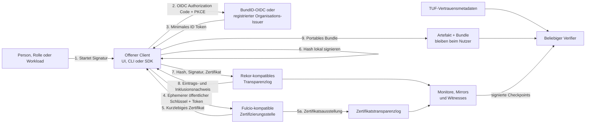

# Offene Vertrauensinfrastruktur für digitale Artefakte

## Wie der Bund einen allgemein nutzbaren digitalen Herkunftsnachweis auf Basis offener Standards schaffen kann

**Stand der Recherche:** 19. Juli 2026  
**Dokumenttyp:** Diskussions- und Entscheidungsgrundlage  
**Adressaten:** Bundes- und Landesverwaltung, Kommunen, öffentliche IT-Dienstleister, Wirtschaft, Wissenschaft und Zivilgesellschaft

---

## Executive Summary

Digitale Verwaltung und digitale Wirtschaft erzeugen täglich Softwarepakete, Dokumente, Datensätze, Container-Images, Bescheide, Modelle, Medien und andere digitale Artefakte. Für ihre Empfänger ist häufig nur schwer automatisiert feststellbar, von wem eine konkrete Fassung stammt, ob sie nach der Veröffentlichung verändert wurde und mit welchem Authentisierungsniveau die signierende Person, Rolle oder Maschine geprüft war. Einzelne Dateiformate, Software-Ökosysteme und Behörden lösen Teile dieses Problems bereits. Es fehlt jedoch eine offene, formatneutrale und organisationsübergreifend nutzbare Vertrauensinfrastruktur.

Dieses Whitepaper schlägt dafür einen **digitalen Herkunftsnachweis** vor. Er verbindet vier Bausteine: eine nachweisbare Authentisierung, ein kurzlebiges Signaturzertifikat, eine kryptografische Signatur über den Hash eines Artefakts und einen Eintrag in einem öffentlich überprüfbaren Transparenzlog. Das Ergebnis wird als portables Bundle gespeichert. Dieses Bundle enthält alle fallbezogenen Nachweise, die ein Prüfprogramm benötigt; nur der regelmäßig aktualisierte Vertrauensanker wird zusätzlich bezogen. Die Prüfung bleibt dadurch auch offline möglich.

Der Ablauf ist bewusst einfach: Ein offener Client erzeugt für einen einzelnen Vorgang einen kurzlebigen Schlüssel, bindet ihn nach einer Anmeldung an eine pseudonyme Identität, signiert den Hash des Artefakts lokal und lässt den Vorgang in ein öffentlich überprüfbares Transparenzlog aufnehmen. Das Artefakt selbst verlässt den Client nicht. Der Identitätsanbieter sieht weder Artefakt noch Hash. Eine zusätzliche staatliche Freigabe einzelner Signaturen ist weder technisch erforderlich noch vorgesehen. Die Umsetzung soll vollständig auf freier Software und offenen, international erprobten Standards beruhen; das Sigstore-Ökosystem mit Fulcio, Rekor, Cosign und TUF dient als technische Referenz, nicht als politischer Selbstzweck oder unveränderbarer Produktzuschnitt.

Der Herkunftsnachweis sagt bewusst wenig – aber dieses Wenige belastbar:

> **Zum Signaturzeitpunkt wurde eine bestimmte pseudonyme Identität auf einem ausgewiesenen Vertrauensniveau authentisiert und an den verwendeten kurzlebigen Signaturschlüssel gebunden.**

Zusammen mit Signatur und Lognachweis lässt sich außerdem prüfen, dass genau die vorliegende Bytefolge signiert wurde und wann die Signatur in das Log aufgenommen wurde. Nicht bestätigt werden Wahrheit, Qualität, Rechtmäßigkeit oder Sicherheit des Inhalts; ebenso wenig Staatsangehörigkeit, Vertretungsmacht, eine rechtsgeschäftliche Willenserklärung, fachrechtliche Aufbewahrungskonformität oder eine qualifizierte elektronische Signatur. Solche Aussagen können andere Verfahren oder zusätzliche Nachweise erfordern.

Als Identitätsquelle wird für einen ersten Erprobungsraum die BundID vorgeschlagen. **[Produktivstand]** Sie ist heute das zentrale Konto für Online-Verwaltungsleistungen und unterstützt unterschiedliche Vertrauensniveaus. **[Empfehlung]** Als eigenständig nutzbare erste Ausbaustufe soll die BundID einen nativen, standardkonformen OIDC-Dienst bereitstellen. Für den Herkunftsnachweis übermittelt er nur eine sektorspezifische pseudonyme Kennung, den vorgesehenen Empfänger, Zeitpunkt und Frische der Anmeldung sowie Vertrauensniveau und verwendetes Authentisierungsmittel. Name, E-Mail-Adresse, Anschrift, Geburtsdatum, Staatsangehörigkeit und sonstige Stammdaten gehören nicht in diesen Nachweis. Ein öffentliches Personenprofil soll eine frische Authentisierung auf hohem Vertrauensniveau verlangen, zunächst insbesondere mit Online-Ausweis und perspektivisch mit einem geeigneten EUDI-Wallet-Verfahren.

Die BundID ist nicht mit dem Online-Ausweis gleichzusetzen. Der Online-Ausweis ist ein hochsicheres elektronisches Identifizierungsmittel auf staatlichen Chipkarten und kann von der BundID als Authentisierungsmittel genutzt werden. Auch die EUDI-Wallet ist nicht automatisch ein für Fulcio nutzbarer OIDC-Anbieter: OpenID4VP dient der Präsentation und OpenID4VCI der Ausgabe digitaler Nachweise. **[Empfehlung]** Die BundID soll Online-Ausweis und später EUDI-Wallet auf der Eingangsseite verwenden und gegenüber Signaturclients ein einheitliches natives OIDC-Profil anbieten. Dadurch bleibt das Signaturprotokoll standardnah und die Identitätsintegration austauschbar.

Für die Praxis werden drei Identitätstypen benötigt. Eine **Person** erscheint ausschließlich unter einem sektorspezifisch stabilen Pseudonym. Eine **Rolle** enthält Organisation und Rollenbezeichnung, normalerweise ohne öffentliches Personenpseudonym. Eine **Workload** bezeichnet ein automatisiertes System und seine verantwortliche Organisation. Rollen- und Workload-Attribute werden dezentral von registrierten Organisations-Issuern ausgegeben; eine zentrale Personal-, Rollen- oder Berechtigungsdatenbank entsteht nicht. Der Vertrauensanker bestätigt, welcher Issuer für welchen Namensraum zugelassen ist – nicht, ob jede einzelne fachliche Handlung zulässig war.

Der öffentliche Charakter ist konstitutiv. Pro Signatur werden nur Artefakthash, Signatur, kurzlebiges Zertifikat, pseudonyme Identität beziehungsweise Organisations- oder Workload-Kennung, Vertrauensniveau, Issuer, Zeit- und Logdaten sowie technisch notwendige Metadaten veröffentlicht. Monitore durchsuchen das Log auf fehlerhafte oder missbräuchliche Einträge. Mirrors halten unabhängige Kopien. Witnesses prüfen die konsistente Erweiterung des Logs und signieren Checkpoints. Das offizielle Mindestquorum soll von gegenüber Betreiber und Ministerium weisungsunabhängigen Institutionen getragen werden; weitere Witnesses müssen ohne individuelle Erlaubnis hinzukommen können. Die Architektur folgt damit dem Leitsatz:

> **Transparenzlog statt staatlich monopolisiertem Wahrheitsanspruch.**

Ein kompromittierter Identitätsanbieter, Issuer oder Signaturclient kann falsche, aber technisch gültige Signaturen erzeugen. Transparenz verhindert das nicht automatisch, macht Missbrauch jedoch sichtbar und nachträglich beweisbar. Widerruf bedeutet deshalb nicht, historische Logeinträge zu löschen. Sperrinformationen, Schlüsselwechsel und Vorfälle werden zusätzlich protokolliert. Ein historischer Nachweis bleibt dann gültig, wenn Zertifikat und Vertrauenskette zum Signaturzeitpunkt gültig waren, der Logeintrag konsistent ist, kein zeitlich einschlägiger Widerruf vorlag und die damals geltende Policy die Verwendung erlaubte.

Datenschutz ist keine Ergänzung, sondern eine Architekturgrenze. Ein dauerhaftes Pseudonym ist regelmäßig weiterhin ein personenbezogenes Datum, wenn die Identitätsstelle die Zuordnung herstellen kann. Ein öffentliches, dauerhaftes Log verstärkt Korrelation, Profilbildung und Unwiderruflichkeit. **[Empfehlung]** Der Pilot soll deshalb vorrangig Organisations-, Rollen- und Workload-Profile verwenden. Personenprofile werden nur begrenzt getestet und erst nach Datenschutz-Folgenabschätzung, tragfähiger Rechtsgrundlage, dokumentierter Erforderlichkeit und unabhängiger Prüfung allgemein geöffnet. Ein widerrufbares Einverständnis ist für ein nicht löschbares öffentliches Log in der Regel keine robuste Dauergrundlage. Die Zuordnung von Pseudonym zu Person verbleibt strikt getrennt bei der zuständigen Identitätsstelle.

Die vorgeschlagene Infrastruktur ist ein öffentliches Gut. Verifikation ist anonym, unbegrenzt und kostenfrei. Übliche Signaturnutzung für Personen bleibt kostenfrei; für Behörden entstehen keine nutzungsabhängigen Gebühren, Lizenz- oder Integrationsentgelte. Vertrauensniveaus dürfen nicht verkauft werden. Für außergewöhnliche private Hochlast kann eine kostenorientierte Beteiligung vorgesehen werden, ohne den offenen Standard oder unabhängige Verifikation zu beschränken. Eigene Instanzen dürfen betrieben werden, erhalten aber nicht automatisch Vertrauen unter der staatlichen Wurzel.

Die technische Basis soll als zentraler nationaler Dienst unter einer einheitlichen Domain betrieben werden, jedoch geografisch redundant, aktiv-aktiv, horizontal skalierbar und organisatorisch kontrollierbar. Logbereiche oder Shards können getrennt werden, ohne eigene Länder- oder Kommunalwurzeln zu schaffen. Länder und Kommunen sind Nutzer, Organisations-Issuer sowie Betreiber von Witnesses und Mirrors. Politische Produktverantwortung liegt sinnvollerweise beim für Verwaltungsdigitalisierung zuständigen Bundesministerium; Betrieb kann bei einem öffentlichen IT-Dienstleister liegen, Sicherheitsanforderungen und Aufsicht beim BSI. Lieferanten bleiben austauschbar. Eine neue Behörde ist keine Voraussetzung.

Der Weg zur Entscheidung ist auf zwölf Monate begrenzt. In den ersten sechs Monaten werden natives BundID-OIDC, kurzlebige Zertifikate, Bundle, öffentliches Testlog, mindestens zwei unabhängig implementierte Prüfprogramme und der unveränderte Upstream-Client Cosign nachgewiesen. In den folgenden sechs Monaten kommen staatlich kontrollierte Testwurzeln, alle drei Identitätsprofile, Basis- und Community-Witnesses, Bedienoberfläche, CLI, SDK, externe Sicherheitsprüfung sowie belastbare Betriebs- und Vollkostenmessung hinzu. Am Ende von Monat zwölf folgt eine öffentliche Produktionsentscheidung anhand vorher veröffentlichter Kriterien. Ein Erfolg wird nicht an der Zahl der Folien, sondern an Interoperabilität, Datenschutz, Sicherheitsbefunden, Verfügbarkeit, Betriebskosten, Nutzererfahrung und tatsächlicher Nutzung gemessen.

Der Nutzen ist unmittelbar: Verwaltungssoftware kann ihre Binärdateien und Container nachweisbar veröffentlichen, Behörden können Datensätze und Bescheide formatneutral signieren, Organisationen können Rollen statt Privatpersonen sichtbar machen, und automatisierte Systeme erhalten nachvollziehbare Workload-Identitäten. Später lassen sich strukturierte Aussagen mit in-toto-Attestierungen, mehrstufige Lieferkettenregeln und C2PA-Herkunftsinformationen ergänzen. Die Kerninfrastruktur bleibt dabei absichtlich schmal: Sie bindet Identität, Schlüssel, Hash und Logzeit – und schafft so eine gemeinsame, offen überprüfbare Grundlage, auf der viele fachliche Vertrauensentscheidungen aufbauen können.

---

## 1. Auftrag, Gegenstand und Leitprinzipien

### 1.1 Ziel

Dieses Whitepaper beschreibt ein technisch und organisatorisch umsetzbares Modell für digitale Herkunftsnachweise im deutschen Staat. Es ist weder Vergabeunterlage noch Rechtsgutachten. Es trennt konsequent zwischen:

- **[Produktivstand]** heute nachweisbar eingesetzten Diensten oder geltendem Recht,
- **[Beschlossene Planung]** verbindlich beschlossenen, aber noch nicht vollständig umgesetzten Vorhaben,
- **[Gesetzentwurf]** noch nicht geltendem Recht,
- **[Empfehlung]** dem in diesem Papier vorgeschlagenen Zielbild und
- **[Schlussfolgerung]** einer aus Quellen und Architektur abgeleiteten Bewertung.

Wo ein Status nicht eigens markiert ist, wird die vorgeschlagene Infrastruktur beschrieben, nicht ein bereits vorhandener Bundesdienst.

### 1.2 Definition: digitales Artefakt

Ein digitales Artefakt ist eine endliche digitale Bytefolge oder eine eindeutig kanonisierte Menge von Bytefolgen, deren Integrität mittels kryptografischem Hash bestimmt werden kann. Beispiele sind Dateien, Archive, Softwarepakete, Container-Manifeste, Datensätze, Dokumente, Medien, Modellgewichte und strukturierte Attestierungen. Die Infrastruktur ist formatneutral: Im Kern werden Hash und Standardmetadaten verarbeitet; formatspezifische Einbettung, Darstellung oder Kanonisierung leisten Adapter und Clients.

### 1.3 Definition: digitaler Herkunftsnachweis

Ein digitaler Herkunftsnachweis ist ein maschinenprüfbarer Beleg, der eine Signatur über ein digitales Artefakt mit

1. einer authentisierten pseudonymen Person, Rolle oder Workload,
2. einem ausgewiesenen Authentisierungs- und Ausstellungsprofil,
3. einem kurzlebigen Zertifikat und
4. einer nachvollziehbaren Aufnahme in ein Transparenzlog

verbindet. Seine Semantik ist enger als die alltagssprachliche Aussage „dies stammt sicher von X“: Er belegt die dokumentierte Bindung und Integrität, nicht die inhaltliche Wahrheit.

### 1.4 Leitprinzipien

1. **Offene Standards und unveränderte Clients.** Protokolle und Formate sind öffentlich; ein etablierter Upstream-Client muss funktionieren.
2. **Datensparsamkeit.** Öffentliche Nachweise enthalten keine Namen oder Verwaltungsstammdaten, sofern sie für die Verifikation nicht zwingend erforderlich sind.
3. **Lokale Signatur.** Artefakt und privater Schlüssel verbleiben im Client.
4. **Transparenz und Beobachtbarkeit.** Vertrauen entsteht aus kryptografischer Prüfung, öffentlicher Protokollierung und unabhängiger Beobachtung.
5. **Portabilität.** Ein Bundle trägt die fallbezogenen Prüfdaten; die Verifikation darf nicht an einen einzelnen Online-Dienst gebunden sein.
6. **Klare Semantik.** Identität, Artefaktintegrität, Vertrauensniveau und Logzeit werden bestätigt; fachliche oder rechtliche Schlussfolgerungen bleiben der Empfänger-Policy vorbehalten.
7. **Öffentliches Gut.** Prüfen ist frei, anonym und nicht kontingentiert; weder proprietäre Software noch eine zentrale Bedienoberfläche sind Zugangsvoraussetzung.
8. **Evolution statt Sonderweg.** Kryptografie, Identitätsmittel und Attestierungsformate werden über versionierte Profile weiterentwickelt.
9. **Vollständig offene Software.** Clients, Serverkomponenten, Konfiguration, Deployment-Beschreibungen und Konformitätstests stehen unter geeigneten Open-Source-Lizenzen; Builds sind reproduzierbar, notwendige Änderungen werden upstream eingebracht und dauerhafte Bundes-Forks ausgeschlossen.

### 1.5 Abgrenzung des ersten Umfangs

Nicht Teil des ersten Umsetzungsschritts sind TLS- und Browserzertifikate, qualifizierte elektronische Signaturen, vollständige E-Mail-Signaturinfrastrukturen, Verschlusssachen und eine automatisierte Prüfung des Inhalts. Solche Anwendungsfelder können später nur in eigenen Profilen und nach eigener Rechts- und Sicherheitsbewertung folgen.

---

## 2. Problem und Nutzen

### 2.1 Fragmentierte Vertrauensinseln

Heute stützen sich Empfänger digitaler Artefakte häufig auf den Transportkanal, eine Download-Webseite, Dateinamen, organisationsinterne Zertifikate oder manuell veröffentlichte Prüfsummen. Diese Mittel lösen unterschiedliche Probleme, sind aber organisationsübergreifend schwer automatisierbar. Ein sicherer TLS-Download belegt beispielsweise den Transport von einem Server, nicht die fortdauernde Herkunft einer später weitergegebenen Datei. Eine Prüfsumme erkennt Änderungen nur dann, wenn auch ihre Quelle authentisch ist.

Software-Ökosysteme haben mit signierten Releases, Paket-Metadaten und Transparenzlogs wertvolle Muster etabliert. Verwaltungsvorgänge verwenden wiederum formatgebundene Signaturen oder Siegel. Das vorgeschlagene System abstrahiert den gemeinsamen Kern – Identitätsbindung, Hashsignatur, Zeitbezug und öffentliche Nachvollziehbarkeit – ohne alle Fachverfahren zu vereinheitlichen.

### 2.2 Warum kurzlebige Schlüssel und Transparenz zusammengehören

Langfristig verwahrte private Signaturschlüssel erzeugen hohe Anforderungen an Ausgabe, Speicherung, Sperrung und Wiederherstellung. Im keyless Sigstore-Modell wird pro Vorgang oder kurzer Sitzung lokal ein Schlüsselpaar erzeugt. Die Zertifizierungsstelle bestätigt den öffentlichen Schlüssel nur für wenige Minuten auf Grundlage einer frischen OIDC-Authentisierung. Das reduziert die Zeit, in der ein entwendeter Schlüssel nutzbar ist. Das Transparenzlog macht ausgestellte und verwendete Nachweise beobachtbar. Beide Mechanismen ergänzen einander: kurze Gültigkeit begrenzt den unmittelbaren Schaden, Transparenz unterstützt Entdeckung und Beweisführung.

### 2.3 Öffentlicher Nutzen

Eine gemeinsame Infrastruktur senkt Integrationskosten, weil Produzenten einmal signieren und Empfänger mit verschiedenen offenen Implementierungen prüfen können. Sie schafft:

- eine gemeinsame maschinenlesbare Herkunftsschicht für Dateien und APIs,
- nachvollziehbare Software- und Datenlieferketten,
- eine datensparsame Alternative zur Veröffentlichung persönlicher Zertifikatsdaten,
- eine Grundlage für rollen- und workloadbezogene Verantwortungszuordnung,
- offene Prüfbarkeit durch Medien, Forschung, Zivilgesellschaft und Marktteilnehmer sowie
- langfristig anschlussfähige Bausteine für in-toto, C2PA und EUDI-Nachweise.

### 2.4 Zielbild aus Sicht der Nutzer

Im Zielbild muss niemand verstehen, wie Zertifikatsketten oder Merkle-Bäume funktionieren. Eine Mitarbeiterin zieht eine freizugebende Datei in eine offene Anwendung, wählt ihre Organisationsrolle und meldet sich an. Die Anwendung zeigt knapp, welche Aussage öffentlich wird, signiert lokal und legt Datei und Nachweis gemeinsam ab. Ein Fachverfahren oder eine Build-Pipeline erledigt denselben Vorgang automatisiert über ein offenes SDK. Eine kleine Softwarefirma, die nur zwei Kommunen beliefert, kann die Schnittstelle ohne Sondervertrag, Lizenzgebühr oder BSI-Zertifizierung ihres Produkts integrieren.

Der Empfänger öffnet die Datei in einem beliebigen kompatiblen Prüfprogramm. Er erhält keine pauschale grüne Aussage „staatlich geprüft“, sondern eine verständliche und maschinenlesbare Antwort: Die Datei ist unverändert; diese pseudonyme Person, Organisationsrolle oder Workload war beim Signieren unter diesem Vertrauensprofil authentisiert; der Vorgang wurde im öffentlichen Log nachweisbar aufgenommen. Fachsoftware kann daraus eigene Regeln ableiten, etwa nur Veröffentlichungen einer bestimmten Behördenrolle zu akzeptieren.

Auch der vorgeschaltete offene BundID-OIDC-Dienst hat einen eigenständigen Nutzen. Ein Onlinedienst kann mit Zustimmung des Nutzers feststellen, dass hinter einer aktuellen Anmeldung eine über die BundID stark authentisierte natürliche Person steht. Diese Aussage enthält weder Namen noch Staatsangehörigkeit und erzeugt dank sektorspezifischer Pseudonyme keine dienstübergreifende öffentliche Kennung. Der vollständige Herkunftsnachweis erweitert diese Fähigkeit anschließend von der Anmeldung auf Dateien, Software, Daten, Nachrichten und maschinell erzeugte Inhalte.

---

## 3. Was der Nachweis aussagt – und was nicht

### 3.1 Positive Aussage

Die technische Kernaussage lautet:

> **Zum Signaturzeitpunkt wurde eine bestimmte pseudonyme Identität auf einem ausgewiesenen Vertrauensniveau authentisiert und an den verwendeten kurzlebigen Signaturschlüssel gebunden.**

Bei erfolgreicher Prüfung lässt sich zusätzlich feststellen:

- Die Signatur passt zum Hash der vorliegenden Bytefolge.
- Das Zertifikat wurde von einer zu diesem Zeitpunkt vertrauenswürdigen Wurzel ausgestellt.
- Identitätsprofil, Issuer und Authentisierungsniveau entsprechen der Empfänger-Policy.
- Der Vorgang wurde zu einem aus dem Lognachweis ableitbaren Zeitpunkt aufgenommen.
- Der Logeintrag ist in einem kryptografisch konsistenten Checkpoint enthalten.

Der Logzeitpunkt ist kein Beweis dafür, wann der Inhalt entstanden ist. Er belegt den spätesten relevanten Zeitpunkt der protokollierten Signatur. Für Anwendungsfälle mit einer von der Loguhr unabhängigen qualifizierten Zeitquelle wäre ein gesondertes Zeitstempelprofil erforderlich.

### 3.2 Ausdrückliche Nichtaussagen

Der Herkunftsnachweis bestätigt **nicht**:

- die Wahrheit, Vollständigkeit oder fachliche Qualität des Inhalts,
- die Rechtmäßigkeit, ethische Vertretbarkeit oder Sicherheit eines Artefakts,
- eine Staatsangehörigkeit,
- Vertretungsmacht oder konkrete fachliche Berechtigung,
- die Abgabe oder Wirksamkeit einer rechtsgeschäftlichen Willenserklärung,
- die Einhaltung fachrechtlicher Aufbewahrungs- und Verfahrenspflichten,
- eine qualifizierte elektronische Signatur oder ein qualifiziertes elektronisches Siegel,
- die Abwesenheit von Schadcode, Manipulation vor dem Signieren oder kompromittierten Erzeugungsprozessen.

Ein gültiger Herkunftsnachweis ist deshalb auch für Schadsoftware möglich: Er macht deren signierende Identität und unveränderte Fassung nachvollziehbar, erklärt den Inhalt aber nicht für sicher oder zulässig.

Ein Rollenprofil „Organisation A / Freigabestelle“ kann beweisen, dass ein von A registrierter Issuer diese Rolle für den Signaturvorgang bescheinigt hat. Ob die Person intern zeichnungsberechtigt war und ob das Verfahren eingehalten wurde, ist eine zusätzliche fachliche Frage.

### 3.3 Vier getrennte Policy-Schichten

Empfänger sollen Vertrauensentscheidungen nicht in eine undurchsichtige Ja/Nein-Prüfung vermischen. Die Referenzimplementierung trennt:

| Policy-Schicht | Prüffrage | Beispiel |
|---|---|---|
| Kryptografie | Ist Hash, Signatur, Zertifikatskette und Logbeweis technisch gültig? | Signaturalgorithmus zugelassen; Bundle vollständig |
| Identität | Ist Issuer, Identitätstyp, `acr`/`amr` und Pseudonymprofil akzeptiert? | Person nur mit frischer Authentisierung auf hohem Niveau |
| Artefakt | Passt das Artefakt zu Typ, Namensraum und erwarteter Quelle? | Container-Repository und Paketname zulässig |
| Empfänger | Erfüllt der Nachweis den konkreten fachlichen Zweck? | Veröffentlichung durch die zuständige Stelle, Vier-Augen-Regel |

Im Kernprototyp werden nur einfache deklarative Prüfparameter benötigt. Allgemeine Policy-Sprachen wie Rego oder CUE können später als Adapter hinzukommen, sind aber keine Voraussetzung für die erste funktionsfähige Kette.

---

## 4. Identität und Authentisierung

### 4.1 BundID, Online-Ausweis und EUDI-Wallet sind unterschiedliche Komponenten

**[Produktivstand]** Die BundID bezeichnet sich als zentrales Konto für Online-Anträge. Sie unterstützt unter anderem Benutzername/Passwort, ELSTER, Online-Ausweis und bestimmte europäische Identifizierungsmittel. Der Betrieb erfolgt nach den veröffentlichten Datenschutzinformationen durch das Informationstechnikzentrum Bund für das zuständige Bundesministerium ([BundID FAQ](https://id.bund.de/faq), [BundID Datenschutz](https://id.bund.de/de/datasecurity)).

**[Produktivstand]** Die Online-Ausweisfunktion ist ein elektronisches Identifizierungsmittel auf Personalausweis, elektronischem Aufenthaltstitel und eID-Karte für Bürgerinnen und Bürger der EU beziehungsweise des EWR. Sie verwendet Besitz der Karte und PIN und kann als starkes Authentisierungsmittel dienen. Sie ist weder ein Bürgerkonto noch ein Signaturdienst ([BSI: Online-Ausweisfunktion](https://www.bsi.bund.de/DE/Themen/Oeffentliche-Verwaltung/Elektronische-Identitaeten/Online-Ausweisfunktion/online-ausweisfunktion.html), [§ 18 Personalausweisgesetz](https://www.gesetze-im-internet.de/pauswg/__18.html)).

**[Beschlossene Planung]** Nach der novellierten eIDAS-Verordnung müssen die Mitgliedstaaten mindestens eine EUDI-Wallet bereitstellen. Die Europäische Kommission nennt Ende 2026 als Zielzeitpunkt. Die Wallet kann Personenidentifizierungsdaten und elektronische Attributsnachweise halten und präsentieren. OpenID4VP standardisiert die Präsentation, OpenID4VCI die Ausgabe solcher Nachweise ([Verordnung (EU) 2024/1183](https://eur-lex.europa.eu/eli/reg/2024/1183/oj), [EU-Kommission zur EUDI-Wallet](https://digital-strategy.ec.europa.eu/en/policies/eudi-regulation), [OpenID4VP 1.0](https://openid.net/specs/openid-4-verifiable-presentations-1_0.html), [OpenID4VCI 1.0](https://openid.net/specs/openid-4-verifiable-credential-issuance-1_0.html)).

**[Gesetzentwurf]** Das Bundeskabinett hat am 20. Mai 2026 einen Entwurf für ein Gesetz über die digitale Identität beschlossen; der Bundesrat hat am 10. Juli 2026 Stellung genommen. Am Recherchestichtag war das Gesetzgebungsverfahren nicht abgeschlossen ([Bundesregierung](https://www.bundesregierung.de/breg-de/aktuelles/digitale-brieftasche-2431500), [BR-Drs. 322/26](https://dserver.bundestag.de/brd/2026/0322-26.pdf), [Stellungnahme des Bundesrates](https://dserver.bundestag.de/brd/2026/0322-26B.pdf)).

**[Beschlossene Planung]** Der IT-Planungsrat fordert mit Beschluss 2026/19 einen zentralen Issuer-/Verifier-Dienst und eine beschleunigte Verwaltungsanbindung der EUDI-Wallet – über die BundID oder unmittelbar. Das zugehörige Zielbild beschreibt MVP-Planungen für 2027; dies ist noch kein Nachweis eines Produktivbetriebs ([IT-Planungsrat, Beschluss 2026/19](https://www.it-planungsrat.de/beschluss/b-2026-19-it)).

**[Schlussfolgerung]** Eine EUDI-Wallet ist nicht automatisch ein OIDC-Identitätsanbieter, dessen Token eine Fulcio-kompatible Zertifizierungsstelle unmittelbar akzeptieren kann. Die fachlichen Protokolle haben unterschiedliche Aufgaben:

- OIDC authentisiert einen Endnutzer gegenüber einem Client und stellt ein ID Token aus.
- OpenID4VP fordert und übermittelt walletbasierte Präsentationen.
- OpenID4VCI stellt digitale Nachweise an eine Wallet aus.

**[Empfehlung]** Die BundID soll Online-Ausweis und EUDI-Wallet als starke Eingangsmittel nutzen und für Signaturclients ein kleines natives OIDC-Profil anbieten. Ein Client erhält dadurch ein gewöhnliches, kurzlebiges OIDC ID Token; die nachgelagerte Signaturkette muss die Eigenheiten des jeweiligen Eingangsmittels nicht kennen.

### 4.2 Minimalprofil für natives BundID-OIDC

Das OIDC-Profil soll auf OpenID Connect Core basieren und exakt den für Zertifikatsausstellung und Policy notwendigen Umfang liefern ([OpenID Connect Core 1.0](https://openid.net/specs/openid-connect-core-1_0-final.html)):

| Claim | Bedeutung im Profil |
|---|---|
| `iss` | eindeutiger HTTPS-Identifier des BundID-OIDC-Issuers |
| `sub` | stabiles, sektorspezifisches und nicht sprechendes Pseudonym |
| `aud` | für den Upstream-Signaturpfad der von Fulcio erwartete Wert `sigstore`; andere BundID-OIDC-Clients erhalten ihre eigene Audience |
| `iat`, `exp` | enge zeitliche Gültigkeit des Tokens |
| `auth_time` | Zeitpunkt der letzten maßgeblichen Authentisierung |
| `acr` | maschinenlesbares Vertrauensniveau und Profil |
| `amr` | tatsächlich verwendete Authentisierungsmethode(n) |
| Sicherheitsparameter | insbesondere Nonce-/Code-Flow-Bindung nach OIDC/OAuth-Profil |

Nicht enthalten sind Name, E-Mail-Adresse, Anschrift, Geburtsdatum, Staatsangehörigkeit und sonstige Stammdaten. Das `sub` wird speziell für diesen Signatursektor gebildet; eine Kennung aus anderen Verwaltungsdiensten darf nicht wiederverwendet werden. OIDC unterstützt paarweise beziehungsweise sektorspezifische Subject-Identifier ausdrücklich. Das Pseudonym ist gegenüber Öffentlichkeit und Empfängern nicht auflösbar; die BundID kann die getrennt gehaltene Zuordnung im gesetzlich zulässigen Rahmen weiterhin besitzen.

Native und Desktop-Clients verwenden Authorization Code mit PKCE und den externen Systembrowser entsprechend [RFC 8252](https://datatracker.ietf.org/doc/html/rfc8252). Dynamische beziehungsweise self-service OIDC-Clientregistrierung soll für geprüfte Redirect-URI-Klassen und öffentliche Clients angeboten werden. Die Zertifizierungsstelle akzeptiert nur den vorgesehenen `aud`-Wert, kurze Tokenlaufzeiten und eine ausreichend frische `auth_time`.

Damit das Vertrauensniveau auch mit unveränderten Upstream-Verifiern eindeutig bleibt, werden Sicherheitsprofile nicht ausschließlich in einer neuen proprietären Zertifikatserweiterung kodiert. Das hohe Personenprofil erhält einen stabilen, eigenen OIDC-Issuer-Identifier und bei Bedarf eine getrennte Zwischenzertifikatskette; ein Verifier kann beides mit den vorhandenen Sigstore-Prüfparametern einschränken. `acr` und `amr` werden bei der Ausstellung zwingend geprüft. Weitere Profile erhalten andere Issuer-Identifier oder Ketten und können deshalb nicht versehentlich als hohes Profil erscheinen. Eine zusätzliche Zertifikatserweiterung darf nur ergänzend verwendet werden, wenn sie standardisiert beziehungsweise upstream akzeptiert und von fremden Implementierungen sicher ignoriert oder geprüft werden kann.

### 4.3 Vertrauensniveaus

Für einen öffentlichen Personen-Herkunftsnachweis ist eine frische Authentisierung auf hohem Niveau erforderlich, zunächst insbesondere Online-Ausweis und perspektivisch ein geeignetes EUDI-Wallet-Verfahren. Niedrigere Niveaus können später in strikt getrennten, maschinenlesbaren Profilen erprobt werden. Sie dürfen nicht durch dieselbe UI-Farbe oder denselben Policy-Default wie das hohe Niveau erscheinen. Die Verifikation gibt das Niveau aus; sie wertet es nicht pauschal als „vertrauenswürdig“.

### 4.4 Drei Identitätstypen

#### Person

Das Zertifikat enthält nur ein sektorspezifisch stabiles Pseudonym, den BundID-Issuer und das Authentisierungsprofil. Ein öffentlicher Name ist nicht notwendig. Kontinuität ist innerhalb des Sektors prüfbar; sektorübergreifende Profilbildung wird technisch erschwert.

#### Rolle

Das Zertifikat bezeichnet Organisation und Rolle, zum Beispiel `org:bund.example/role:release`. In der Regel wird kein persönliches Pseudonym öffentlich protokolliert. Der registrierte Organisations-Issuer bestätigt die Rollenzuordnung für kurze Zeit. Interne Nachvollziehbarkeit kann organisationsseitig in einem getrennten, zugriffsgeschützten Auditpfad erfolgen. Ein Wechsel von Organisation oder Rolle erzeugt eine andere öffentliche Identität.

#### Workload

Das Zertifikat bezeichnet ein automatisiertes System, beispielsweise `org:bund.example/workload:build/prod-1`, und die verantwortliche Organisation. Authentisierung kann über kurzlebige workloadgebundene Nachweise und attestierte Laufzeitumgebungen erfolgen. Personen- und Workload-Profile sind kryptografisch und policyseitig unterscheidbar.

### 4.5 Dezentrale Organisations-Issuer

Es entsteht kein zentrales Personal-, Rollen- oder Berechtigungsverzeichnis. Eine Organisation betreibt oder beauftragt ihren Issuer für ihren Namensraum. Die zentrale Infrastruktur führt nur ein öffentliches Issuer-Verzeichnis mit:

- Organisationskennung und verifiziertem Namen,
- autorisierten Namensräumen,
- Issuer-Endpunkten und Schlüsseln,
- Sicherheitskontakt,
- Metadatenversion und Gültigkeitszeitraum,
- Sperr-, Vorfall- und Beendigungsstatus.

Zu Beginn werden öffentliche Stellen und öffentliche IT-Dienstleister registriert. Später können verifizierte private juristische Personen hinzukommen. Voraussetzung sind Organisations- und Domainprüfung, belastbarer Sicherheitskontakt, veröffentlichte Metadaten, ein Sperrverfahren und ein Vorfallprozess. Der zentrale Dienst bestätigt die Zulassung des Issuers, nicht sämtliche von ihm verwalteten internen Rechte.

Innerhalb ihres Namensraums kann jede Organisation eigene Rollen und Claims definieren, Nutzern oder Workloads zuweisen und wieder entziehen – funktional vergleichbar mit der dezentralen Verwaltung organisationsinterner Anwendungen und Rollen in etablierten Identity-Plattformen. Die zentrale Infrastruktur genehmigt weder das einzelne Rollenvokabular noch die einzelne Zuweisung. Für den interoperablen Kern werden Rolle und Workload in standardisierten URI-Namensräumen ausgedrückt; umfangreichere fachliche Claims können später in signierten Attestierungen transportiert werden.

---

## 5. Technische Architektur

### 5.1 Komponenten und Datenfluss

Der Upstream-Ablauf entspricht dem von Sigstore dokumentierten Modell: Der Client erzeugt ein ephemeres Schlüsselpaar, bezieht ein OIDC-Token, erhält ein kurzlebiges und zertifikatstransparent ausgestelltes Zertifikat, signiert lokal und protokolliert die Signatur in einem Transparenzlog ([Sigstore Signing Overview](https://docs.sigstore.dev/cosign/signing/overview/), [Fulcio: OIDC](https://docs.sigstore.dev/certificate_authority/oidc-in-fulcio/), [Fulcio: Certificate Issuing Overview](https://docs.sigstore.dev/certificate_authority/certificate-issuing-overview/)).

### 5.2 Signaturablauf

1. Der Client berechnet lokal den kryptografischen Hash des Artefakts.
2. Er erzeugt lokal ein ephemeres Schlüsselpaar; der private Schlüssel wird nicht exportiert und nach Abschluss verworfen.
3. Im Systembrowser authentisiert sich die Person über BundID-OIDC. Für Rollen oder Workloads wird das passende Issuer-Profil verwendet.
4. Der Client übermittelt das OIDC-Token und den öffentlichen Schlüssel an die Zertifizierungsstelle.
5. Die Zertifizierungsstelle prüft `iss`, `aud`, Laufzeit, `auth_time`, `acr`, `amr`, Nonce/Flow-Bindung und Profil. Sie stellt ein sehr kurzlebiges Zertifikat aus und versieht es über das getrennte Zertifikatstransparenzlog mit einem prüfbaren Ausstellungsnachweis. Dorthin gelangen Zertifikat und Ausstellungsmetadaten, aber weder Artefakt noch Artefakthash.
6. Der Client signiert lokal den Artefakthash.
7. Er übermittelt Hash, Signatur, Zertifikat und notwendige Metadaten an das Transparenzlog. Das Artefakt wird nicht übertragen.
8. Nach bestätigter Aufnahme speichert der Client Signatur, Zertifikat, Logeintrag, Inklusionsmaterial und erforderliche Zeitnachweise in einem Bundle.
9. Ein Verifier prüft Bundle, Artefakthash, Zertifikatskette, Policy und Logkonsistenz gegen den über TUF verteilten Vertrauensanker.

Die BundID sieht weder Artefakt noch Hash. Sie authentisiert den Nutzer und gibt ein minimales Token an den Client aus. Der Vorgang enthält keine zusätzliche staatliche Inhaltsprüfung oder Signaturfreigabe.

### 5.3 Zertifikatsprofil

Das X.509-Profil bleibt kompatibel mit Fulcio und dem Sigstore-Ökosystem. Es enthält mindestens:

- pseudonyme Subject-Identität in einer von Fulcio unterstützten URI-SAN-Darstellung,
- OIDC-Issuer,
- öffentlichen ephemeren Schlüssel,
- sehr kurze Gültigkeitsdauer.

Personen-, Rollen- und Workload-Identitäten verwenden getrennte URI-Namensräume. Organisations- und Rollenbezeichnungen können dadurch im SAN selbst ausgedrückt werden; das hohe Vertrauensprofil ergibt sich aus dem zugelassenen OIDC-Issuer und der Zertifikatskette. Persönliche Stammdaten sind ausgeschlossen. Die konkrete Kodierung muss in einem öffentlichen Zertifikatsprofil festgelegt und mit unveränderten Sigstore-Bibliotheken getestet werden. Zusätzliche Felder im Bundle oder Zertifikat dürfen keine Voraussetzung für die kryptografische Grundprüfung mit Upstream-Clients sein. Für fachlich reichere Aussagen sind nach dem Kernpilot signierte Attestierungen vorgesehen.

### 5.4 Portables Bundle

Das Bundle ist der primäre Übergabegegenstand. Es enthält die Signatur, das Signaturzertifikat beziehungsweise die Verifikationsdaten einschließlich des eingebetteten Zertifikatstransparenznachweises, Signaturtransparenzlog-Einträge samt Inklusionsmaterial, Zeitinformationen und die Bindung an den Artefakthash. Das Sigstore-Protobuf-Schema definiert hierfür ein versioniertes Bundle-Medienformat mit Zertifikats-, Log- und Zeitnachweisen ([Sigstore Bundle Specification](https://github.com/sigstore/protobuf-specs/blob/main/protos/sigstore_bundle.proto), [Cosign: Verifying Signatures](https://docs.sigstore.dev/cosign/verifying/verify/)).

Ein vollständiges Bundle ermöglicht die Offline-Prüfung, sobald Verifier und Vertrauensanker vorhanden sind. Online-Zugriff bleibt für aktuelle Sperr- oder Policyinformationen und die Beobachtung neuer Logzustände sinnvoll, darf aber nicht Voraussetzung für die kryptografische Prüfung eines archivierten Vorgangs sein.

### 5.5 Harte Interoperabilitätsanforderung

Die wichtigste technische Abnahmebedingung lautet:

> **Eine unveränderte veröffentlichte Upstream-Version von Cosign muss nach Konfiguration der Bundesendpunkte interaktiv über BundID signieren und das Ergebnis anschließend verifizieren können.**

„Unverändert“ schließt einen Fork, proprietäre Plug-ins oder verdeckte Patches aus. Erlaubt sind die von Upstream vorgesehenen Konfigurationsmechanismen für OIDC-Issuer, Fulcio-, Log- und TUF-Endpunkte sowie erwartete Identität. Sigstore dokumentiert die Nutzung eigener Komponenten und Vertrauenswurzeln ausdrücklich ([Cosign: Custom Components](https://docs.sigstore.dev/cosign/system_config/custom_components/)).

### 5.6 Drei gleichberechtigte Clientpfade

1. **Offizieller Open-Source-Client:** eine zugängliche, verständliche Oberfläche für Dateien und Standardformate; zusätzlich CLI für Verwaltung und Automatisierung.
2. **Unveränderter Upstream-Client:** Cosign als harter Beleg für Protokollkompatibilität.
3. **Offenes SDK und Protokoll:** Bibliotheken, Beispiele und Testvektoren für unabhängige Implementierungen.

Die offizielle Oberfläche ist kein Gatekeeper. Öffentliche Dokumentation, SDKs, Beispiele, Sandbox, Testidentitäten, Konformitätstests und Self-Service-Registrierung machen Dritte gleichberechtigt. Verifikation erfordert weder Konto noch Clientregistrierung.

### 5.7 Verifikationsalgorithmus

Ein Verifier erhält Artefakt, Bundle, erwartete Policy und einen vertrauenswürdigen TUF-Root. Er:

1. parst nur unterstützte, eindeutig versionierte Bundle- und Zertifikatsformate,
2. berechnet den Artefakthash und prüft die Signatur,
3. validiert Zertifikatskette, Gültigkeitsintervall und zugelassene Algorithmen,
4. prüft OIDC-Issuer, SAN-Namensraum, Identitätstyp und das aus Issuer beziehungsweise Zertifikatskette eindeutig folgende Vertrauensprofil,
5. prüft Logsignatur, Eintragskörper, Inklusionsnachweis und akzeptierte Witness-Checkpoints,
6. berücksichtigt zeitlich geltende Sperr-, Schlüssel- und Policyinformationen,
7. gibt jede Policy-Schicht getrennt sowie eine begründete Gesamtauswertung aus.

Mindestens zwei unabhängig implementierte Programme müssen dieselben positiven und negativen Testvektoren bestehen. Sigstore bietet Bibliotheken in mehreren Sprachen; dies erleichtert, ersetzt aber nicht die geforderte Implementationsunabhängigkeit ([Sigstore Language Clients](https://docs.sigstore.dev/language_clients/language_client_overview/)).

---

## 6. Transparenzlog, Witnesses, Monitore und Mirrors

### 6.1 Öffentlicher Loginhalt

Das öffentliche Rekor-kompatible Signaturtransparenzlog enthält ausschließlich:

- Artefakthash,
- Signatur,
- kurzlebiges Zertifikat,
- pseudonyme Personenkennung oder Organisations-/Rollen-/Workload-Kennung,
- aus OIDC-Issuer beziehungsweise Zertifikatskette ableitbares Vertrauensniveau und Profil,
- Issuer,
- Aufnahmezeit und Logindex,
- technisch notwendige Metadaten und kryptografische Nachweise.

Das Artefakt selbst wird nie im Log gespeichert. Freitextfelder sind im Kernformat zu vermeiden, weil sie personenbezogene oder geheime Inhalte einschleusen können. Eingaben werden strikt größenbegrenzt und schema-validiert. Das getrennte Zertifikatstransparenzlog enthält ausgestellte kurzlebige Zertifikate und ihre Ausstellungsnachweise, aber keinen Artefakthash und keine Signatur über das Artefakt.

### 6.2 Rollen im Transparenzsystem

**Logbetreiber** nehmen Einträge an, bilden einen append-only Merkle-Baum und veröffentlichen signierte Checkpoints. **Witnesses** akzeptieren neue Checkpoints nur, wenn deren konsistente Erweiterung gegenüber einem zuvor gesehenen Zustand nachgewiesen ist, und signieren sie. **Monitore** laden und analysieren Loginhalt, suchen beispielsweise unberechtigte Zertifikatsausstellungen oder Policyverletzungen und alarmieren Betroffene. **Mirrors** halten unabhängige Kopien der Einträge und Checkpoints, erhöhen Verfügbarkeit und erschweren nachträgliches Verschwinden. Diese Funktionen sind verschieden; ein Mirror ist nicht automatisch Monitor oder Witness ([Transparency.dev: Witness Network](https://blog.transparency.dev/can-i-get-a-witness-network), [Transparency.dev: Witnesses](https://transparency.dev/witnesses/)).

### 6.3 Witness-Modell

Der Basisdienst verlangt ein dokumentiertes Quorum aus organisatorisch, infrastrukturell und gegenüber Logbetreiber sowie produktverantwortlichem Ministerium weisungsunabhängigen Witnesses. Das offizielle Quorum muss mehrere institutionelle Klassen umfassen, etwa Hochschulen und wissenschaftlich unabhängige Forschungseinrichtungen, Zivilgesellschaft, wirtschaftliche Nutzer der Infrastruktur und internationale Open-Source-Stiftungen. Staatliche Stellen können zusätzliche Witnesses betreiben, dürfen das offizielle Quorum aber weder allein bilden noch politisch anweisen. Konkrete Organisationen werden erst durch offene, überprüfbare Teilnahmevereinbarungen und veröffentlichte Unabhängigkeitskriterien benannt.

Die Aufnahme weiterer Community-Witnesses bleibt erlaubnisfrei: Jeder kann Checkpoints prüfen und signieren. Die offizielle Policy legt lediglich fest, welches unabhängige Mindestquorum ein Referenz-Verifier akzeptiert; andere Verifier dürfen strengere oder zusätzliche Quoren konfigurieren.

Checkpoint- und Witness-Formate sind offen, klein und replizierbar. Verifier können strengere eigene Quoren konfigurieren. Ein Angreifer müsste für einen unbemerkten Split View genügend Log- und Witness-Schlüssel oder die Sicht der jeweiligen Empfänger kontrollieren. Community-Gossip und Veröffentlichung von Checkpoints über mehrere unabhängige Kanäle reduzieren dieses Restrisiko.

### 6.4 Widerruf ohne Löschen

Transparenz ist unveränderlich; Datenschutz- und Sicherheitskorrekturen erfolgen daher durch zusätzliche Statusereignisse, nicht durch Löschung historischer Einträge. Protokolliert werden:

- Sperrung eines Identitäts-, Organisations- oder Workload-Namensraums,
- Kompromittierungszeitpunkt eines Issuers oder Schlüssels,
- Ersetzung und Rotation von Wurzeln und Zwischenzertifikaten,
- Rücknahme einer Rollen- oder Organisationszulassung,
- fehlerhafte Ausstellung und Incident-Klassifikation,
- neue Policy-Version und ihr Inkrafttreten.

Eine historische Prüfung bestimmt den zum Signatur- und Logzeitpunkt geltenden Zustand. „Heute gesperrt“ bedeutet nicht automatisch „damals ungültig“. Wird dagegen eine Kompromittierung rückwirkend ab einem früheren Zeitpunkt festgestellt, muss der Verifier Nachweise in diesem Intervall als unbekannt oder abgelehnt kennzeichnen.

### 6.5 Geschützte Logbereiche als spätere Option

Für vertrauliche Artefaktnamensräume kann später ein zugriffsgeschützter Logbereich geprüft werden. Dessen Checkpoints und Konsistenznachweise bleiben öffentlich; Eintragsdetails sind nur autorisierten Prüfern zugänglich. Das mindert Offenheit und erhöht Komplexität, insbesondere für Community-Monitoring und Datenschutzrechte. Es ist daher kein Bestandteil des Kernpiloten. Eine Einführung kommt erst in Betracht, wenn Format und Prüfverfahren offen standardisiert sind und unveränderte Upstream-Clients beziehungsweise gleichwertig unabhängige Implementierungen interoperabel bleiben.

---

## 7. Vertrauensanker, Schlüsselmanagement und Kryptografie

### 7.1 TUF als Verteilungs- und Rotationsmechanismus

TUF verteilt Root-, Targets-, Snapshot- und Timestamp-Metadaten mit Versionen, Ablaufzeiten und Schwellwertsignaturen. Dadurch können Clients neue Vertrauenswurzeln und Endpunktmetadaten sicher beziehen und zugleich Rollback- und Freeze-Angriffe erkennen ([TUF Specification](https://theupdateframework.github.io/specification/), [TUF-Spezifikation auf GitHub](https://github.com/theupdateframework/specification/blob/master/tuf-spec.md)).

Das Startpaket jedes Clients enthält einen kleinen initialen TUF-Root beziehungsweise dessen geprüften Fingerabdruck. Updates werden nur akzeptiert, wenn die Versions- und Schwellwertregeln erfüllt sind. Mehrere Mirrors verteilen identische Metadaten, darunter Zertifizierungs-, Signaturlog- und Zertifikatstransparenzlog-Schlüssel. Ein Bundle enthält nicht beliebige selbstbehauptete neue Wurzeln; andernfalls könnte ein Angreifer seine eigene Vertrauenskette mitliefern.

### 7.2 Root-Betrieb

Die staatliche Offline-Root wird in Hardware-Sicherheitsmodulen mit Mehrpersonenfreigabe betrieben. Schlüsselmaterial ist geografisch und organisatorisch getrennt; Zeremonien, Teilnehmerrollen, Hashes der erzeugten Metadaten und Abweichungen werden veröffentlicht. Online-Zwischenschlüssel sind kurz genug gültig, um den Schaden zu begrenzen, und werden getrennt nach Funktion geführt: Zertifikatsausstellung, Log, TUF-Zeitstempel/Snapshot sowie gegebenenfalls Witness.

Root- und Schlüsselerneuerungen werden vorab angekündigt, parallel ausgerollt und durch alte wie neue Metadaten überlappend abgesichert. Notfallrotation folgt einem vorab veröffentlichten Verfahren. Jeder Verifier kann den vollständigen Versionspfad prüfen.

### 7.3 Krypto-Agilität

Der Start verwendet von Upstream-Komponenten unterstützte und nach aktueller BSI-Richtlinie geeignete Algorithmen und Parameter. Profile nennen Algorithmus, Parameter, Bundle-Version, Mindest-Clientversion und Auslaufdatum explizit. Die BSI TR-02102-1 wird regelmäßig aktualisiert; eine statische Festschreibung „für immer“ wäre daher falsch ([BSI TR-02102-1](https://www.bsi.bund.de/SharedDocs/Downloads/DE/BSI/Publikationen/TechnischeRichtlinien/TR02102/BSI-TR-02102.html)).

Post-Quanten-Migration wird von Beginn an vorbereitet: Algorithmus-IDs sind nicht implizit, Bundles können mehrere Signaturen tragen, TUF kann neue Schlüsseltypen verteilen, Testvektoren umfassen Hybridprofile und Archivstrategien. Eine produktive Umstellung erfolgt erst nach Standardisierung, Upstream-Interoperabilität, BSI-Bewertung und Leistungstests. Das BSI empfiehlt für die Migration unter anderem hybride Ansätze, weist aber zugleich auf deren Komplexität hin ([BSI: Kryptografie quantensicher gestalten](https://www.bsi.bund.de/SharedDocs/Downloads/DE/BSI/Publikationen/Broschueren/Kryptografie-quantensicher-gestalten.pdf?__blob=publicationFile&v=6)).

### 7.4 Langfristige Prüfbarkeit

Langzeitarchive speichern Artefakt, Bundle, alle damals relevanten TUF-Metadaten, akzeptierte Checkpoints, Sperrereignisse und die angewandte Policy-Version. Vor Ablauf der kryptografischen Eignung können Archive Nachweise erneuern oder in neue, signierte Archivcontainer überführen. Die ursprüngliche Signatur wird nicht umgedeutet; die Erneuerung dokumentiert lediglich, dass der alte Beweis vor dem Algorithmusablauf geprüft und neu gesichert wurde.

---

## 8. Datenschutz und Daten-Governance

### 8.1 Rechtliche und technische Einordnung

Ein sektorstabiler pseudonymer Identifier ist nicht anonym, wenn die Identitätsstelle ihn mit zusätzlichen Informationen einer Person zuordnen kann. Die DSGVO definiert Pseudonymisierung gerade als Verarbeitung, bei der eine Zuordnung mit gesondert aufbewahrten Zusatzinformationen möglich bleibt. Daher gelten insbesondere Zweckbindung, Datenminimierung, Speicherbegrenzung, Datenschutz durch Technikgestaltung, Sicherheit und gegebenenfalls Datenschutz-Folgenabschätzung ([DSGVO, insbesondere Art. 4 Nr. 5, 5, 25, 32 und 35](https://eur-lex.europa.eu/eli/reg/2016/679/oj?locale=de)).

Der Europäische Datenschutzausschuss hat 2025 Leitlinien zur Pseudonymisierung zur Konsultation gestellt und ebenfalls hervorgehoben, dass pseudonymisierte Daten personenbezogene Daten bleiben können. **[Statushinweis]** Am Recherchestichtag wird die verlinkte Fassung als konsultierter Leitlinienentwurf behandelt, nicht als geltendes Gesetz ([EDSA, Guidelines 01/2025](https://www.edpb.europa.eu/public-consultations/guidelines-012025-on-pseudonymisation_en)).

### 8.2 Besondere Risiken des öffentlichen Dauerlogs

Auch ein nicht sprechendes Pseudonym ermöglicht über viele Signaturen eine Aktivitätszeitlinie. Artefakthashes können durch Wörterbuchangriffe bekannten Dateien zugeordnet werden. Rollen- oder Workload-Namen können interne Organisationsstrukturen offenlegen. Ein unveränderliches Log kann Einträge nicht nachträglich „vergessen“. Hinzu kommen IP-Adressen und Telemetriedaten außerhalb des eigentlichen Logs.

Deshalb gelten folgende Grenzen:

- getrennte Pseudonyme pro Sektor und, wo sachgerecht, pro Profil,
- keine Namen, Kontaktangaben oder Stammdaten im Zertifikat oder Log,
- keine frei wählbaren öffentlichen Metadaten,
- getrennte, besonders geschützte Zuordnung bei der Identitätsstelle,
- kurze Aufbewahrung und strikte Zweckbindung für Netz- und Betriebslogs,
- Proxy-/Relay-Optionen gegen unnötige IP-Korrelation,
- öffentliche Schemata, Datenschutztests und reproduzierbare Logscanner,
- dokumentierte Löschgrenzen und transparente Information vor der Signatur.

### 8.3 Rechtsgrundlage und Pilotgrenze

Einwilligung ist für einen dauerhaften öffentlichen Eintrag problematisch, wenn sie widerruflich sein soll, der Eintrag technisch und sicherheitsfachlich aber nicht gelöscht werden darf. **[Empfehlung]** Eine allgemeine Personenfunktion wird daher erst eingeführt, wenn Zweck, Verantwortlichkeiten, Empfängerkreis, Aufbewahrungslogik und Betroffenenrechte auf einer tragfähigen gesetzlichen Grundlage oder einer anderweitig belastbaren Rechtsgrundlage beruhen. Zuvor sind Datenschutz-Folgenabschätzung und unabhängige Prüfung zu veröffentlichen.

Im Pilot dominieren Organisations-, Rollen- und Workload-Profile. Personenprofile werden nur mit informierten Testpersonen, nichtsensiblen Artefakten, gesonderter Testwurzel und klarer Nichtproduktivkennzeichnung erprobt. Testdaten dürfen nicht in die spätere Produktionswurzel übernommen werden.

### 8.4 Verantwortlichkeiten

Die politische Produktverantwortung, der technische Logbetrieb, die Identitätsstelle und Organisations-Issuer haben unterschiedliche datenschutzrechtliche Rollen, die vor Produktivstart vertraglich und gesetzlich eindeutig festzulegen sind. Ein gemeinsames Verzeichnis der Verarbeitungstätigkeiten, standardisierte Issuer-Verträge und ein koordinierter Betroffenen- und Incident-Prozess sind erforderlich. Die öffentliche Spezifikation dokumentiert für jedes Feld Zweck, Quelle, Verantwortlichen, Sichtbarkeit und Aufbewahrungsdauer.

---

## 9. Sicherheit: Bedrohungen, Maßnahmen und Restrisiken

Die Tabelle ist eine Kurzfassung. Für den Pilot ist ein vollständiges Bedrohungsmodell nach Sigstore-Vorbild, einschließlich Annahmen über Identitätsanbieter, Zertifizierungsstelle, Log, Clients und Monitore, öffentlich fortzuschreiben ([Sigstore Threat Model](https://docs.sigstore.dev/about/threat-model/), [Sigstore Security](https://docs.sigstore.dev/about/security/)).

| Bedrohung | Zentrale Maßnahmen | Verbleibendes Risiko |
|---|---|---|
| Kontoübernahme bei der Identitätsstelle | hohes Authentisierungsniveau, frische `auth_time`, kurze Token- und Zertifikatslaufzeit, Nutzerwarnung, Logmonitoring | Angreifer kann im kurzen Fenster technisch gültig signieren; Log macht dies sichtbar, verhindert es aber nicht |
| Kompromittierter Organisations-Issuer | Namensraumbegrenzung, HSM, kurzlebige Nachweise, öffentliche Issuer-Metadaten, Sperr- und Incident-Prozess | falsche Rollen-/Workload-Zuordnungen bis Entdeckung |
| Kompromittierte Zertifizierungsstelle | getrennte Schlüssel, kurze Intermediate-Laufzeit, CT-/Ausstellungsmonitoring, Mehrpersonen-Notfallrotation | massenhafte Falschausstellung im Kompromittierungsfenster |
| Kompromittierter Logbetreiber / Split View | Merkle-Konsistenz, unabhängige Witness-Quoren, Gossip, Mirrors, öffentliche Checkpoints | Kollusion oder vollständige Netzisolation bestimmter Empfänger |
| Manipulierter Signaturclient | reproduzierbare Builds, signierte Releases, minimale Berechtigungen, unabhängige Clients, lokale Hashanzeige | Endpunkt kann anderes Artefakt signieren oder Daten exfiltrieren |
| Token-Diebstahl oder Replay | PKCE, Nonce, enger `aud`, sehr kurze Laufzeit, Kanalbindung soweit standardisiert, einmalige Fulcio-Verwendung | Malware auf demselben Endgerät kann Sitzungsdaten übernehmen |
| Schlüssel- oder Algorithmusbruch | versionierte Profile, Krypto-Agilität, TUF-Rotation, Archiv-Erneuerung, PQ-Migrationsplan | überraschender Durchbruch vor Erneuerung |
| Denial of Service | aktiv-aktiv, horizontale Skalierung, Rate Limits, DDoS-Schutz, Warteschlangen, Kapazitätsreserve | Signieren ist während schwerer Störung nicht möglich; Offline-Prüfung bleibt möglich |
| Veröffentlichung sensibler Daten im Log | starres Schema, keine Freitexte/Artefakte, Größenlimits, Datenschutzprüfung, Testscanner | Hash-Rückschluss und Metadatenkorrelation bleiben möglich |
| Missbrauch vertrauenswürdig wirkender Identität | klare Nichtaussagen, getrennte Policy-Schichten, UI ohne pauschales „staatlich geprüft“ | Empfänger können Nachweis weiterhin überinterpretieren |
| Supply-Chain-Angriff auf Komponenten | unveränderte Upstream-Basis, SBOM, reproduzierbare Builds, signierte Abhängigkeiten, externe Audits | unbekannte Upstream-Schwachstellen |
| Insiderangriff auf Root oder Betrieb | HSM, Schwellwert- und Mehrpersonenfreigaben, Funktionstrennung, protokollierte Zeremonien, Rotation | Kollusion mehrerer privilegierter Personen |
| Veralteter oder eingefrorener Verifier | TUF-Ablaufzeiten und Rollback-Schutz, Statuswarnungen, mitarchivierte historische Metadaten | dauerhaft isolierte Systeme können neue Sperrungen nicht kennen |

Sicherheitsmeldungen werden über einen veröffentlichten Prozess entgegengenommen. Kritische Vorfälle erhalten eine unveränderliche öffentliche Zeitleiste, Ursachenanalyse und Prüfdaten. Fehlerprämien und regelmäßige unabhängige Penetrationstests sind vorzusehen.

---

## 10. Verfügbarkeit, Skalierung und Betrieb

### 10.1 Verfügbarkeitssemantik

Es gibt bewusst keinen normalen Offline-Signaturmodus. Eine neue keyless Signatur benötigt Identitätsanbieter, Zertifizierungsstelle und Transparenzlog. Fiele eine dieser Komponenten aus, könnte ein Offline-Modus deren aktuelle Policy und Sperrinformationen umgehen. Bereits erzeugte Bundles bleiben mit lokalem Artefakt und aktuellem beziehungsweise archiviertem Vertrauensanker offline prüfbar. Eine etwaige hardwarebasierte Notfallausnahme ist ausschließlich eine spätere Anhangsoption (Anhang C), nicht Teil des Kernbetriebs.

### 10.2 Zielarchitektur des Betriebs

Der nationale Dienst verwendet eine zentrale, dauerhaft erkennbare Domain. Er wird über mindestens zwei geografisch getrennte Standorte aktiv-aktiv bereitgestellt. Stateless-Komponenten skalieren horizontal. Identität, Zertifikatsausstellung, Log, TUF-Verteilung und Betriebsadministration liegen in getrennten Funktions- und Sicherheitsbereichen. Zustandsbehaftete Logkomponenten verwenden replizierte, prüfbare Speicherung; Ausfall- und Wiederanlaufverfahren dürfen keinen bereits bestätigten Eintrag verlieren. Getrennte Logbereiche oder Shards begrenzen Fehlerdomänen, teilen aber denselben nationalen Vertrauensanker und dieselbe öffentliche Policy.

Mindestens erforderlich sind:

- DDoS-Schutz, Rate-Limits und Missbrauchserkennung ohne personenbezogene Dauerprofile,
- 24/7-Bereitschaft und öffentliches Status-Dashboard,
- regelmäßig geübter Standort- und Schlüsselnotfall,
- Neustart-, Restore- und Kapazitätstests unter realer Last,
- überlappende Zertifikats-, Log- und TUF-Rotation ohne geplante Signaturunterbrechung,
- Ende-zu-Ende-Monitoring einschließlich BundID-OIDC, nicht nur einzelner Server,
- öffentlich definierte SLOs, Fehlerbudgets und Incident-Berichte.

**[Empfehlung]** Zielwert ist mindestens 99,95 % monatliche Ende-zu-Ende-Verfügbarkeit für interaktives Signieren. Das ist ein steuerbarer Betriebszielwert, keine gesetzliche Garantie. Verifikation aus einem vorhandenen Bundle ist davon unabhängig.

### 10.3 Integrität vor scheinbarer Verfügbarkeit

Ein Logeintrag gilt erst als bestätigt, wenn die zur Bundle-Erstellung erforderliche dauerhafte Speicherung und der kryptografische Aufnahmebeleg vorliegen. Bei unklarem Commit-Status wiederholt der Client idempotent oder fragt den Eintrag ab; er darf keinen Erfolg vortäuschen. Wiederanlauf wird durch Abgleich von replizierten Daten, Merkle-Zustand, Mirrors und Witness-Checkpoints geprüft. Datenverlust eines bestätigten Eintrags ist ein kritischer Sicherheitsvorfall, nicht nur eine Verfügbarkeitsstörung.

### 10.4 Betriebs- und Kostenmessung

Die zweite Pilotphase misst nicht nur Serverlast, sondern den vollständigen Dienst: Identitätsaufrufe, Zertifikatsausstellung, Logspeicher, Mirror- und Witness-Verkehr, Support, Incident-Bereitschaft, HSM, Audits, Softwarepflege und Langzeitarchiv. Kennzahlen werden normalisiert pro Signatur, Logwachstum und aktivem Issuer veröffentlicht. Erst diese Messwerte ermöglichen eine belastbare Entscheidung über Kapazität und Finanzierung.

Im Verhältnis zu bestehenden Identitätsplattformen und zu den vermiedenen parallelen Einzellösungen ist von einem vergleichsweise geringen Finanzbedarf auszugehen. Eine erste grobe Betrachtung legt einen niedrigen zweistelligen Millionenbetrag für Aufbau und initialen Produktionsbetrieb nahe.

---

## 11. Governance und Public-Good-Modell

### 11.1 Zuständigkeiten

**[Empfehlung]** Die politische Produktverantwortung liegt beim [Bundesministerium für Digitales und Staatsmodernisierung (BMDS)](https://bmds.bund.de/) als dem am Recherchestichtag für Verwaltungsdigitalisierung zuständigen Ressort. Ein öffentlicher IT-Dienstleister – etwa ITZBund oder eine vergleichbare öffentliche Betriebsstruktur – führt den technischen Betrieb. Das BSI definiert Sicherheitsprofile, begleitet Root- und Schlüsselverfahren, bewertet Audits und koordiniert schwerwiegende Sicherheitslagen. Unabhängige Prüfer untersuchen Implementierung, Infrastruktur, Datenschutz und Governance.

Vertrauenswurzeln bleiben staatlich kontrolliert. Produktpolitik, Zertifikatsprofile, OIDC-Profil, Issuer-Verzeichnis, Roadmap, Schlüsselwechsel, Betriebskennzahlen, Sicherheitsvorfälle und Auditberichte werden öffentlich dokumentiert. Sicherheitsrelevante Schwachstellendetails können bis zur Behebung geschützt bleiben; anschließend folgt eine nachvollziehbare Veröffentlichung.

Lieferanten liefern austauschbare Komponenten auf Basis öffentlicher Schnittstellen. Quellcode, Deployment-Beschreibungen, Testvektoren, Datenexporte und Betriebsdokumentation verhindern Lock-in. Für die Einführung ist keine neue Behörde erforderlich.

### 11.2 Rolle von Ländern und Kommunen

Länder und Kommunen erhalten keine eigenen inkompatiblen Wurzelhierarchien. Sie sind gleichberechtigte Nutzer, können registrierte Organisations-Issuer betreiben und Witnesses, Mirrors oder Monitore anbieten. Getrennte Logbereiche können fachliche Zuständigkeiten und Skalierung abbilden, bleiben jedoch unter gemeinsamer nationaler Domain, Root-Policy und Konformität.

### 11.3 Offene Mitwirkung

Ein öffentliches technisches Steuerungsgremium bearbeitet Spezifikationsänderungen in offenen Verfahren. Sitzungsunterlagen, Entscheidungen, Minderheitenvoten und Referenztests werden veröffentlicht. Wirtschaft, Wissenschaft und Zivilgesellschaft können Vorschläge, Implementierungen, Monitore und Witnesses beitragen. Keine einzelne Betreibergruppe erhält ein Vetorecht über unabhängige Verifikation.

### 11.4 Nutzungs- und Entgeltgrundsätze

- Verifikation ist anonym, unbegrenzt und kostenfrei.
- Übliche persönliche Signaturnutzung ist kostenfrei.
- Öffentliche Stellen zahlen keine nutzungsabhängigen Signaturgebühren und keine Lizenz- oder Integrationsentgelte.
- Ein höheres Vertrauensniveau ist nicht käuflich; es folgt ausschließlich dem Authentisierungs- und Issuerprofil.
- Faire technische Nutzungsgrenzen dürfen Missbrauch verhindern, müssen öffentlich, gleichbehandelnd und überprüfbar sein.
- Außergewöhnliche private Hochlast kann kostenorientiert beteiligt werden, ohne offene Verifikation oder kleine Nutzer zu belasten.
- Jeder darf kompatible Instanzen selbst betreiben; daraus folgt kein automatisches Vertrauen unter der staatlichen Wurzel.

### 11.5 Nachhaltigkeit

Die Haushaltsplanung muss Betrieb, Sicherheitsupdates, Schlüsselzeremonien, Audits, Langzeitarchiv und Community-Infrastruktur mehrjährig abdecken. Ein befristetes Projekt ohne dauerhafte Produktverantwortung wäre für einen Vertrauensanker ungeeignet. Zugleich verhindert eine klare Ausstiegs- und Migrationsregel Abhängigkeit: Wurzeln und Endpunkte können geordnet ersetzt werden, historische Bundles bleiben prüfbar.

---

## 12. Umsetzung in zwölf Monaten

### 12.1 Phase 1 – Interoperabler technischer Kern, Monate 0 bis 6

Ziel ist ein öffentlich nachvollziehbarer Ende-zu-Ende-Nachweis, nicht ein Produktivdienst.

Die Arbeiten folgen dabei einer klaren Reihenfolge: Zunächst wird der native BundID-OIDC-Dienst als offen dokumentierte und unabhängig nutzbare Basisfunktion hergestellt. Darauf setzt der Herkunftsnachweis ohne proprietäre Übergangsschicht auf. Spätestens bis zum Ende der ersten Phase müssen beide Teile gemeinsam interoperabel funktionieren.

Liefergegenstände:

1. natives BundID-OIDC-Testprofil mit minimalen Claims und Authorization Code + PKCE,
2. Fulcio-kompatible Ausstellung sehr kurzlebiger Zertifikate,
3. Rekor-kompatibles öffentliches Testlog,
4. portables, versioniertes Sigstore-Bundle,
5. mindestens zwei unabhängig implementierte Prüfprogramme,
6. öffentliche Spezifikation, Testvektoren, Sandbox und Testidentitäten,
7. Datenschutz-Vorprüfung und Bedrohungsmodell,
8. automatisierter Negativtest für falsche Identität, falschen Hash, abgelaufenes Zertifikat, manipulierten Logbeweis und zurückgerollte TUF-Metadaten.

Harte Abnahme:

> **Eine unveränderte veröffentlichte Upstream-Version von Cosign muss nach Konfiguration der Bundesendpunkte interaktiv über BundID signieren und das Ergebnis anschließend verifizieren können.**

Scheitert diese Anforderung, wird nicht durch einen proprietären Client-Sonderweg kaschiert. Ursache, erforderliche Standardänderung und Entscheidung über Fortführung werden veröffentlicht.

### 12.2 Phase 2 – Realistischer Erprobungsbetrieb, Monate 7 bis 12

Liefergegenstände:

1. staatlich kontrollierte Testwurzeln mit dokumentierter HSM- und Mehrpersonenzeremonie,
2. Personen-, Rollen- und Workload-Profile,
3. registrierte Organisations-Issuer für öffentliche Pilotstellen,
4. mehrere Basis-Witnesses und offen beitretende Community-Witnesses,
5. Mirror- und Monitor-Referenzimplementierungen,
6. barrierearme Web-/Desktop-Oberfläche, CLI und offene SDKs,
7. unveränderte Upstream-Komponenten, wo das Protokoll dies vorsieht,
8. unabhängige Sicherheits- und Datenschutzprüfung,
9. Last-, Ausfall-, Wiederanlauf-, Rotations- und Split-View-Übungen,
10. Betriebs- und Vollkostenmessung über den gesamten Pfad einschließlich BundID.

Pilotartefakte sind nicht vertraulich und klar als Test gekennzeichnet. Mindestens je ein realer Software-, Daten- und Dokumentenprozess wird mit seinen Empfänger-Policies erprobt.

### 12.3 Produktionsentscheidung am Ende von Monat 12

Die Ergebnisse und Rohkennzahlen werden veröffentlicht. Die Entscheidung folgt vorher festgelegten Kriterien:

| Kriterium | Mindestnachweis für eine positive Entscheidung |
|---|---|
| Upstream-Interoperabilität | unverändertes Cosign besteht Signatur und Verifikation; Bundle ist standardkonform |
| Implementationsvielfalt | zwei unabhängige Verifier stimmen bei veröffentlichten Positiv- und Negativvektoren überein |
| Datenschutz | abgeschlossene Folgenabschätzung für den vorgesehenen Umfang; keine unnötigen Stammdaten; beherrschte Logkorrelation |
| Sicherheit | keine offenen kritischen Befunde; Root-, Issuer-, Log- und Client-Bedrohungen getestet |
| Transparenz | Witness-Quorum, Mirror und mindestens ein unabhängiger Monitor praktisch nachgewiesen |
| Verfügbarkeit | realistische Ende-zu-Ende-Messung stützt das Ziel von 99,95 %; kein Verlust bestätigter Einträge in Übungen |
| Krypto-Agilität | geplante und Notfallrotation ohne Ausfall; Versionierungs- und Migrationspfad belegt |
| Betrieb | 24/7-Prozess, Incident-Verfahren, Zuständigkeiten und Vollkosten tragfähig |
| Wirtschaftlichkeit | gemessene Vollkosten und Skaleneffekte rechtfertigen einen dauerhaften öffentlichen Dienst gegenüber getrennten Einzellösungen |
| Nutzbarkeit | verständliche Darstellung der engen Nachweisaussage; barrierearme Kernwege; vertretbare Abschlussquote |
| Adoption | mehrere unabhängige Produzenten und Empfänger nutzen offene Schnittstellen, nicht nur die Referenzoberfläche |
| Unabhängigkeit/Föderation | austauschbare Betreiberkomponenten, ein weisungsunabhängiges offizielles Witness-Quorum sowie zusätzliche Mirrors, Monitore und Community-Witnesses von Bund, Ländern/Kommunalbereich und unabhängigen Dritten |

Bei Erfolg folgt die Überführung in einen öffentlichen Dienst mit schrittweiser Aufnahme weiterer Issuer und Anwendungsprofile. Geschützte Logbereiche und zusätzliche Attestierungsformate werden erst danach separat entschieden. Bei Nichterfüllung werden Kriterien, Messwerte und mögliche Nachbesserung transparent gemacht; ein politischer Produktivtermin ersetzt keine technische Abnahme.

---

## 13. Rechtliche Einordnung

### 13.1 Elektronische Signatur nach eIDAS

**[Produktivstand]** Artikel 25 der eIDAS-Verordnung untersagt, einer elektronischen Signatur allein wegen ihrer elektronischen Form oder fehlender Qualifikation die Rechtswirkung und Beweiskraft abzusprechen. Nur die **qualifizierte** elektronische Signatur hat ausdrücklich die gleiche Rechtswirkung wie eine handschriftliche Unterschrift. Für qualifizierte elektronische Siegel gelten besondere Vermutungswirkungen ([konsolidierte eIDAS-Verordnung, Art. 25 und 35](https://eur-lex.europa.eu/legal-content/DE/TXT/?uri=CELEX:02014R0910-20241018)).

Der hier beschriebene Herkunftsnachweis ist im Kern keine qualifizierte elektronische Signatur und kein qualifiziertes Siegel. Ob ein konkretes Personen-, Rollen- oder Workload-Profil rechtlich als elektronische Signatur, elektronisches Siegel oder sonstiger technischer Beweis einzuordnen ist, hängt von Aussteller, Signierendem und Verwendung ab. Der Nachweis kann erheblichen Beweiswert besitzen, ersetzt aber weder vorgeschriebene Schriftformen noch qualifizierte Vertrauensdienste. Ob eine Signatur zugleich eine Willenserklärung darstellt, ergibt sich aus Kontext, Verfahren und Recht, nicht aus dem Bundle allein.

### 13.2 Vertretung, Zuständigkeit und Organisationsrollen

Ein Organisations-Issuer kann eine Rollenbehauptung ausstellen. Das öffentliche Register beweist, dass der Issuer für den Namensraum zugelassen war. Vertretungsmacht, Haushaltsbefugnis, Zeichnungsordnung oder sachliche Zuständigkeit werden dadurch nicht automatisch bestätigt. Ein Empfänger kann solche Bedingungen in seiner fachlichen Policy abbilden und zusätzliche Register- oder Workflow-Nachweise verlangen.

### 13.3 Erforderliche rechtliche Vorbereitung

Vor Produktivstart sind insbesondere zu klären:

- gesetzliche Aufgabe und Rechtsgrundlage für öffentliches Log und sektorstabiles Pseudonym,
- Rollen der beteiligten Verantwortlichen und Auftragsverarbeiter,
- Informations- und Betroffenenrechte bei unveränderlichen Einträgen,
- Haftungs- und Gewährleistungsgrenzen ohne irreführenden Vertrauensanspruch,
- Beweiswert und Behördenakzeptanz der maschinenlesbaren Nachweise,
- Zulassung, Aufsicht und Beendigung von Organisations-Issuern,
- Archiv- und Löschkonzept für Log, Betriebsdaten und Zuordnungstabellen.

---

## Anhang A: Ausbaupfade nach dem Kernpilot

### A1. Strukturierte Attestierungen mit in-toto

Für einen einfachen Herkunftsnachweis genügt die Signatur über Artefakthash und Standardmetadaten. Später können strukturierte Aussagen als in-toto-Attestierungen signiert werden. Das in-toto Statement bindet Subjekte über Digests an einen typisierten Prädikatinhalt; eine Layout-/Link-Struktur kann zusätzlich vorgeben, welche Schritte in welcher Lieferkette von welchen Functionaries ausgeführt werden dürfen ([in-toto Attestation Statement v1](https://github.com/in-toto/attestation/blob/main/spec/v1/statement.md), [in-toto Specification](https://github.com/in-toto/docs/blob/master/in-toto-spec.md)).

Stufenmodell:

1. Herkunft: normale Signatur und Bundle.
2. Aussage: typisierte Attestierung, etwa Build-Parameter oder Prüfergebnis.
3. Prozess: mehrstufige in-toto-Layoutprüfung.
4. Entscheidung: Empfänger-Policy, gegebenenfalls mit Rego/CUE-Adapter.

Die Infrastruktur bestätigt dabei weiterhin nur, wer die Attestierung unter welchem Profil signierte und dass sie unverändert ist; sie bestätigt nicht automatisch deren Wahrheitsgehalt.

### A2. C2PA und gekennzeichnete KI-Inhalte

C2PA Content Credentials binden standardisierte Assertions und einen signierten Claim kryptografisch an Medien. Aktionen und digitale Quelltypen können beispielsweise dokumentieren, dass Inhalte algorithmisch erzeugt oder bearbeitet wurden; Manifestdaten können eingebettet oder extern referenziert werden ([C2PA Content Credentials 2.4](https://spec.c2pa.org/specifications/specifications/2.4/specs/ContentCredentials.html), [C2PA Guidance 2.4](https://spec.c2pa.org/specifications/specifications/2.4/guidance/Guidance.html)). Die hier vorgeschlagene Identitäts- und Logschicht kann C2PA-Manifeste oder deren externe Nachweise signieren und transparent protokollieren.

> **Statt KI-Inhalte mit unzuverlässigen Verfahren nachträglich erraten zu wollen, ermöglicht die Infrastruktur ihren Erzeugern, sie bereits bei der Entstehung überprüfbar zu kennzeichnen.**

Die Grenzen sind wesentlich: Nicht kooperierende oder lokale Werkzeuge können Kennzeichnung weglassen; Screenshots, Transkodierung oder Metadatenentfernung können Verbindungen lösen; das Fehlen eines Nachweises beweist keine menschliche Urheberschaft; ein vorhandener Nachweis bestätigt die signierte Aussage des Erzeugers, nicht automatisch ihre Wahrheit. C2PA ist kein universeller KI-Detektor und soll keine pauschalen Werturteile über Inhalte transportieren.

### A3. Qualifizierte Signaturen und Zeitstempel

Anwendungsfälle mit gesetzlichem Schriftformerfordernis oder qualifiziertem Zeitnachweis können später qualifizierte Vertrauensdienste als zusätzliche Schicht verwenden. Ein solches Profil muss eIDAS-Konformität, Vertrauensdiensteanbieter, Zertifikatssemantik, Haftung und Langzeitvalidierung gesondert lösen. Der offene Herkunftsnachweis wird dadurch ergänzt, nicht rückwirkend zur qualifizierten Signatur erklärt.

---

## Anhang B: 22 konkrete Anwendungsfälle

Jeder Anwendungsfall folgt demselben Acht-Punkte-Raster. Die Beispiele illustrieren Empfänger-Policies; sie erweitern nicht die enge Kernaussage des Herkunftsnachweises.

### B1. Release einer Verwaltungssoftware

1. **Ziel:** Bürger, Behörden und IT-Dienstleister sollen Binärdateien einer veröffentlichten Verwaltungssoftware eindeutig einer freigebenden Stelle und Version zuordnen und unveränderte Weitergaben prüfen können.
2. **Produzent:** Produktteam oder Release-Stelle einer Behörde beziehungsweise eines öffentlichen IT-Dienstleisters.
3. **Artefakt:** Installationspaket, Binärdatei, Quellarchiv und optional Manifest mit Versions- und Repository-Verweisen.
4. **Identitätsprofil:** Rolle `Organisation/Software-Release`; bei automatisiertem Release zusätzlich Workload `Organisation/Build-Pipeline`.
5. **Empfänger-Policy:** Zertifikat muss aus dem registrierten Release-Namensraum stammen, das vorgesehene Vertrauensprofil besitzen, im Log enthalten und zum Versionszeitpunkt nicht gesperrt sein. Bei zwei Stufen müssen Build- und Release-Identität verschieden sein.
6. **Ablauf:** CI erzeugt und signiert das Build-Artefakt; eine Release-Rolle prüft und signiert den veröffentlichten Hash. Portal und Paket werden mit Bundles ausgeliefert. Mirrors können beides unverändert weitergeben.
7. **Mehrwert:** Herkunft bleibt auch außerhalb der Download-Domain prüfbar; kompromittierte Mirror- oder CDN-Dateien fallen auf. Dritte können ohne Behördenkonto automatisiert verifizieren.
8. **Grenzen/Risiken:** Die Signatur beweist weder Schadcodefreiheit noch korrekten Quellcode. Eine kompromittierte Buildumgebung kann ein schädliches, formal gültig signiertes Paket erzeugen; reproduzierbare Builds, SBOM und in-toto sind ergänzend nötig.

### B2. Container-Image für eine Verwaltungsplattform

1. **Ziel:** Nur Images aus einem zugelassenen Build- und Freigabeprozess sollen in Produktionsclustern ausgeführt werden.
2. **Produzent:** Container-Buildsystem und verantwortliches Plattformteam.
3. **Artefakt:** OCI-Manifest beziehungsweise unveränderlicher Image-Digest; Tags dienen nicht als Sicherheitsanker.
4. **Identitätsprofil:** Workload für die Build-Pipeline, Rolle für eine optionale Produktionsfreigabe.
5. **Empfänger-Policy:** Admission Controller akzeptiert nur erwartete Organisation, Registry-Namensraum, Workload und aktuelle Policy-Version; Bundle und Witness-Checkpoint müssen gültig sein.
6. **Ablauf:** Die Pipeline signiert den Digest nach dem Build. Der Cluster prüft bei Deployment offline aus gecachtem Trust Root oder online mit aktuellen Statusdaten. Eine Freigaberolle kann eine getrennte Attestierung hinzufügen.
7. **Mehrwert:** Registry-Kompromittierung oder Tag-Umschreiben reicht nicht zum Einschleusen eines anderen Images. Dieselbe Policy ist über mehrere Cluster und Betreiber portierbar.
8. **Grenzen/Risiken:** Laufzeitkompromittierung und verwundbare, aber korrekt signierte Images bleiben möglich. Hochverfügbare Policyverteilung und ein definierter Umgang mit veralteten Offline-Roots sind erforderlich.

### B3. Software Bill of Materials und Prüfattestierungen

1. **Ziel:** Empfänger sollen eine SBOM und Sicherheitsprüfergebnisse kryptografisch einem konkreten Softwareartefakt und Aussteller zuordnen.
2. **Produzent:** Build-Pipeline, Softwarelieferant oder unabhängige Prüfstelle.
3. **Artefakt:** SPDX-/CycloneDX-Datei oder in-toto-Attestierung mit Digest des untersuchten Produkts.
4. **Identitätsprofil:** Workload für automatisch erzeugte SBOM; Organisationsrolle für Audit- oder Freigabeaussagen.
5. **Empfänger-Policy:** Akzeptierte `predicateType`, erwarteter Subjekt-Digest, zugelassener Issuer, frische Scanner-/Policyversion und getrennte Bewertung von Herkunft und fachlichem Inhalt.
6. **Ablauf:** Ein Werkzeug erzeugt die strukturierte Aussage, signiert deren Hash und veröffentlicht Bundle und Attestierung neben der Software. Empfänger prüfen zunächst Herkunft, danach fachliche Vollständigkeit.
7. **Mehrwert:** SBOM und Produkt können nicht unbemerkt vertauscht werden; Aussagen mehrerer Prüfer sind vergleichbar und automatisiert auswertbar.
8. **Grenzen/Risiken:** Eine gültig signierte SBOM kann unvollständig oder falsch sein. Die Infrastruktur bewertet weder Scannerqualität noch Abdeckung; sie macht nur Aussteller, Integrität und Zeitpunkt nachvollziehbar.

### B4. Automatisierter Build in einer CI/CD-Lieferkette

1. **Ziel:** Jeder Schritt einer mehrstufigen Lieferkette soll nachvollziehbar einem autorisierten Workload und seinen Ein- und Ausgaben zugeordnet werden.
2. **Produzent:** Source-, Build-, Test-, Scan- und Release-Workloads.
3. **Artefakt:** in-toto-Link- oder Attestierungsobjekte mit Material- und Produkt-Digests.
4. **Identitätsprofil:** Je Stufe eine getrennte Workload-Identität unter dem Namensraum der verantwortlichen Organisation.
5. **Empfänger-Policy:** Ein versioniertes in-toto-Layout verlangt Reihenfolge, erlaubte Functionaries, Digest-Übergaben und notwendige Prüfschritte.
6. **Ablauf:** Jede Pipeline-Stufe signiert ihre strukturierte Aussage. Der abschließende Verifier prüft alle Bundles, das Layout und die Übereinstimmung der Digests.
7. **Mehrwert:** Ein einzelnes gültiges Releasezertifikat reicht nicht mehr, wenn vorgeschriebene Build- oder Prüfschritte fehlen. Organisationsgrenzen werden ohne gemeinsame Geheimnisse überbrückt.
8. **Grenzen/Risiken:** Kompromittierte Runner können falsche Aussagen über ihre tatsächliche Ausführung signieren. Laufzeitattestierung, Isolation und reproduzierbare Ergebnisse bleiben zusätzliche Kontrollen.

### B5. Amtlicher Open-Data-Datensatz

1. **Ziel:** Nachnutzende sollen erkennen, welche konkrete Fassung eines Datensatzes von der zuständigen Stelle veröffentlicht wurde.
2. **Produzent:** Fachbehörde oder kommunale Datenstelle.
3. **Artefakt:** CSV, JSON, GeoPackage, Parquet oder ein Manifest für mehrere Dateien.
4. **Identitätsprofil:** Rolle `Organisation/Open-Data-Veröffentlichung` oder Workload bei regelmäßig automatisierter Publikation.
5. **Empfänger-Policy:** Erwartete Organisation, Datensatzkennung, Version, Artefakthash und Mindestvertrauensprofil; bei Serien muss die Vorgängerversion referenziert werden.
6. **Ablauf:** Das Portal signiert vor Veröffentlichung die Dateien oder ein kanonisches Manifest. Bundle und Prüfanweisung stehen über API und Download bereit. Archive speichern alle Fassungen.
7. **Mehrwert:** Dritte können Daten über Mirrors, Forschungsrepositorien oder Datentreuhänder beziehen und dennoch die amtliche Veröffentlichung prüfen. Korrekturen werden als neue Fassungen sichtbar.
8. **Grenzen/Risiken:** Herkunft beweist keine statistische Richtigkeit, Aktualität oder datenschutzrechtliche Zulässigkeit. Kleine oder bekannte Datensätze können aus dem öffentlichen Hash erraten werden; sensible Daten gehören nicht in dieses Profil.

### B6. Behördenübergreifende Datenlieferung

1. **Ziel:** Eine empfangende Behörde soll Integrität und absendende Organisationsrolle einer Datenlieferung automatisiert prüfen.
2. **Produzent:** Fachverfahren oder Exportstelle der liefernden Behörde.
3. **Artefakt:** Verschlüsseltes Lieferpaket oder Manifest mit Digests einzelner Dateien; der öffentliche Hash bezieht sich auf den Ciphertext.
4. **Identitätsprofil:** Rolle der Datenbereitstellung oder verantwortliche Workload.
5. **Empfänger-Policy:** Zugelassene Quellorganisation und Lieferrolle, erwartete Fall-/Serienkennung außerhalb des öffentlichen Logs, Gültigkeit und gegebenenfalls Vier-Augen-Nachweis.
6. **Ablauf:** Nach Verschlüsselung für den Empfänger wird das Paket lokal signiert. Nur Hash und Nachweisdaten gelangen ins öffentliche Log; fachliche Metadaten werden über den geschützten Transportkanal übermittelt.
7. **Mehrwert:** Verschlüsselung und Herkunft ergänzen sich. Ein Übertragungsdienst kann das Paket weder lesen noch unbemerkt austauschen; der Empfänger ist nicht an denselben Transportkanal gebunden.
8. **Grenzen/Risiken:** Hashes können Lieferzeit und -frequenz offenlegen. Hochsensible Vorgänge benötigen eventuell einen späteren geschützten Logbereich. Die Signatur ersetzt keine Rechtsgrundlage für die Datenübermittlung.

### B7. Digitaler Bescheid als PDF

1. **Ziel:** Ein Empfänger soll eine heruntergeladene oder weitergeleitete Bescheiddatei der ausstellenden Behörde zuordnen und Veränderungen erkennen.
2. **Produzent:** Bescheiderzeugendes Fachverfahren oder zuständige Sachbearbeitungsrolle.
3. **Artefakt:** Exakte PDF-Bytefolge und optional ein standardisiertes Metadatenmanifest.
4. **Identitätsprofil:** Organisationsrolle oder Workload; standardmäßig kein öffentliches Personenpseudonym der Sachbearbeitung.
5. **Empfänger-Policy:** Erwartete Behördenorganisation, Bescheidprofil und gültiger Lognachweis. Fallnummer, Name und Inhalt dürfen nicht in öffentliche Zertifikats- oder Logfelder gelangen.
6. **Ablauf:** Das Fachverfahren erzeugt die endgültige PDF-Datei, signiert ihren Hash und legt Bundle und Datei in das Nutzerkonto beziehungsweise Archiv. Ein Verifier zeigt Organisation, Profil, Zeitpunkt und Integrität getrennt an.
7. **Mehrwert:** Der Nachweis bleibt bei Ausdruck, Scan oder neu gerenderter Datei nicht automatisch erhalten, aber die ursprüngliche Datei ist außerhalb des Portals prüfbar. Phishing mit veränderten PDF-Bescheiden wird erschwert.
8. **Grenzen/Risiken:** Rechtsbehelfsfrist, Bekanntgabe, Zuständigkeit und materielle Rechtmäßigkeit folgen nicht aus dem Bundle. PDF-Einbettung ist ein Clientadapter; der formatneutrale externe Bundlepfad bleibt maßgeblich.

### B8. Amtliche Verkündung oder öffentliche Bekanntmachung

1. **Ziel:** Langfristig soll feststellbar sein, welche Fassung eines amtlichen Veröffentlichungspakets von der zuständigen Stelle publiziert wurde.
2. **Produzent:** Verkündungs- oder Bekanntmachungsstelle.
3. **Artefakt:** PDF/XML/HTML-Snapshot und kanonisches Manifest mit Ausgabe, Datum und Digests.
4. **Identitätsprofil:** Eng begrenzte Organisationsrolle mit Mehrpersonenprozess.
5. **Empfänger-Policy:** Genau definierter Herausgeber-Namensraum, notwendige Freigaberollen, gültige Policy am Veröffentlichungszeitpunkt und Archiv-Checkpoint.
6. **Ablauf:** Nach fachlicher Endfreigabe signieren die vorgesehenen Rollen das Manifest. Archiv, Portal und Bibliotheken speichern Artefakte, Bundles, TUF-Stand und Checkpoints.
7. **Mehrwert:** Historische Fassungen und Mirrors sind kryptografisch vergleichbar; nachträgliche stille Ersetzung wird sichtbar. Langzeitarchive erhalten maschinenlesbare Herkunftsinformationen.
8. **Grenzen/Risiken:** Der Nachweis bestimmt nicht, ob eine Verkündung rechtlich wirksam war. Form-, Zuständigkeits- und Publikationsrecht bleiben maßgeblich; dafür kann ein eigenes, rechtlich geprüftes Profil erforderlich sein.

### B9. Vergabeunterlagen und Bieterkommunikation

1. **Ziel:** Beteiligte sollen die von einer Vergabestelle veröffentlichte Fassung von Unterlagen und Antworten nachvollziehen können.
2. **Produzent:** Vergabestelle beziehungsweise definierte Veröffentlichungsrolle.
3. **Artefakt:** Bekanntmachung, Leistungsbeschreibung, Anlagenpaket oder anonymisierte Frage-Antwort-Fassung.
4. **Identitätsprofil:** Organisationsrolle; bei Portalveröffentlichung zusätzlich Workload.
5. **Empfänger-Policy:** Erwartete Vergabestelle, Verfahrenskennung außerhalb personenbezogener Felder, chronologische Versionskette und gültiger Rollen-Namensraum.
6. **Ablauf:** Jede freigegebene Fassung wird signiert und mit Bundle bereitgestellt. Änderungen referenzieren den Vorgänger-Digest; Empfänger archivieren die von ihnen verwendete Fassung.
7. **Mehrwert:** Streit über unveränderte Unterlagen und Änderungsstände lässt sich technisch besser aufklären. Plattformwechsel oder Mirror-Downloads zerstören den Herkunftsnachweis nicht.
8. **Grenzen/Risiken:** Vertrauliche Bieterunterlagen dürfen nicht in das öffentliche Log gelangen; gegebenenfalls wird nur verschlüsselter Ciphertext signiert. Fristwahrung, Zugang und Vergaberechtskonformität werden nicht automatisch bewiesen.

### B10. Veröffentlichung amtlicher Statistik

1. **Ziel:** Tabellen, Berichte und maschinenlesbare Daten sollen einer konkreten amtlichen Veröffentlichung und Revisionsstufe zugeordnet werden können.
2. **Produzent:** Statistisches Amt oder fachlich zuständige Veröffentlichungsstelle.
3. **Artefakt:** Tabellen, Datenwürfel, Bericht und Manifest einer Veröffentlichungsserie.
4. **Identitätsprofil:** Rolle `Statistik-Veröffentlichung`; Workload für automatisierte Exporte.
5. **Empfänger-Policy:** Amt, Serienkennung, Revisionsstatus, erwartete Dateimenge und Signatur nach dokumentierter Freigabe.
6. **Ablauf:** Ein Manifest fasst alle Ausgabeformate zusammen. Korrekturen erzeugen neue, signierte Revisionen und verweisen auf ersetzte Digests, ohne alte Logeinträge zu entfernen.
7. **Mehrwert:** Forschung und Medien können Daten aus Archiven oder Drittsystemen prüfen und Revisionen transparent unterscheiden. Zitierte Fassungen bleiben eindeutig.
8. **Grenzen/Risiken:** Methodische Qualität, statistische Geheimhaltung und sachliche Interpretation werden nicht bestätigt. Vor Veröffentlichung muss ausgeschlossen sein, dass Metadaten oder kleinteilige Hashes Rückschlüsse auf geschützte Zellen erlauben.

### B11. Kriseninformation und Lagekarte

1. **Ziel:** Öffentlichkeit und Einsatzorganisationen sollen eine schnell verbreitete Datei oder Kartenfassung der zuständigen Quelle zuordnen können.
2. **Produzent:** Lagezentrum, Warnstelle oder autorisierter Veröffentlichungs-Workload.
3. **Artefakt:** CAP-Nachricht, GeoJSON, Kartenbild oder signiertes Manifest mehrerer Ressourcen.
4. **Identitätsprofil:** Organisationsrolle oder hochverfügbare Workload; persönliche Identität ist für die öffentliche Prüfung nicht nötig.
5. **Empfänger-Policy:** Autorisierte Warnorganisation, regionaler Namensraum, kurze Aktualitätsgrenze und eindeutige Nachfolge-/Entwarnungsbeziehung.
6. **Ablauf:** Die Quelle signiert jede freigegebene Fassung. Rundfunk, Apps und Mirrors verbreiten Artefakt plus Bundle; Clients prüfen lokal und zeigen zugleich Aktualität und Herausgeber an.
7. **Mehrwert:** Schnelle dezentrale Verbreitung wird mit überprüfbarer Herkunft verbunden. Ein kompromittierter Social-Media-Kanal allein kann keine gültige Warnfassung erzeugen.
8. **Grenzen/Risiken:** Bei Ausfall von IdP, Zertifizierungsstelle oder Log ist keine neue normale Signatur möglich. Krisenverfahren brauchen daher robuste aktiv-aktive Dienste; ein späteres Hardware-Notprofil muss auffällig getrennt gekennzeichnet werden.

### B12. Forschungsdatensatz aus öffentlicher Förderung

1. **Ziel:** Publizierte Daten und Auswertungsskripte sollen Projekt, Institution und Version nachvollziehbar zugeordnet werden.
2. **Produzent:** Hochschule, Forschungsinstitut oder öffentliches Projektkonsortium.
3. **Artefakt:** Datenpaket, Codearchiv, Modell und Manifest mit persistenten Identifikatoren.
4. **Identitätsprofil:** Organisationsrolle oder Workload; optional Personenpseudonym nur nach gesonderter Datenschutzbewertung.
5. **Empfänger-Policy:** Registrierte juristische Person, Projekt-Namensraum, Digestbezug zwischen Daten, Code und Bericht sowie akzeptiertes Veröffentlichungsprofil.
6. **Ablauf:** Ein Repositorium signiert oder übernimmt von der Projektrolle signierte Bundles. Neue Versionen verweisen auf Vorgänger; Zitationsmetadaten bleiben fachlich getrennt.
7. **Mehrwert:** Reproduzierbarkeit und Zitation erhalten einen maschinenprüfbaren Herkunftsanker. Mehrere Institutionen können eigene Attestierungen zum selben Datensatz hinzufügen.
8. **Grenzen/Risiken:** Wissenschaftliche Validität, Einwilligungen von Studienteilnehmenden und Forschungsintegrität werden nicht technisch garantiert. Personenbezogene Rohdaten und erratbare Kleinstdateien sind für das öffentliche Log ungeeignet.

### B13. Veröffentlichte Prüfdokumentation oder Auditbericht

1. **Ziel:** Ein öffentlicher Bericht soll der tatsächlich verantwortlichen Prüforganisation und einer unveränderten Fassung zugeordnet werden.
2. **Produzent:** Rechnungshof, Datenschutzaufsicht, Zertifizierungs- oder externe Prüfstelle.
3. **Artefakt:** Bericht, Prüfvermerk oder strukturiertes Ergebnismanifest.
4. **Identitätsprofil:** Organisationsrolle `Audit-Veröffentlichung`; keine pauschale persönliche Namensveröffentlichung.
5. **Empfänger-Policy:** Zugelassene Prüforganisation, Berichtstyp, endgültiger Versionsstatus und gegebenenfalls zweiter Freigabenachweis.
6. **Ablauf:** Nach redaktioneller und rechtlicher Freigabe signiert die Rolle die endgültige Datei. Das Veröffentlichungsportal liefert Bundle und lesbare Prüfhinweise mit.
7. **Mehrwert:** Zitate und Spiegelkopien lassen sich einer Originalfassung zuordnen; stille Änderungen oder gefälschte „Behördenberichte“ sind leichter erkennbar.
8. **Grenzen/Risiken:** Unabhängigkeit, Methodik und Richtigkeit des Audits werden nicht aus der Signatur abgeleitet. Entwürfe und vertrauliche Anlagen benötigen getrennte Kennzeichnung beziehungsweise dürfen nicht öffentlich protokolliert werden.

### B14. Modellgewicht und Trainingsdokumentation eines KI-Systems

1. **Ziel:** Betreiber sollen nachvollziehen können, welche Modell-, Konfigurations- und Dokumentationsfassung freigegeben wurde.
2. **Produzent:** Modelllieferant, öffentliches KI-Labor oder verantwortliche MLOps-Pipeline.
3. **Artefakt:** Modellgewicht, Container, Modellkarte und strukturierte Attestierungen zu Training und Evaluation.
4. **Identitätsprofil:** Workload für Build/Training, Organisationsrolle für Einsatzfreigabe.
5. **Empfänger-Policy:** Erwartete Organisation, Modellfamilie, Digest aller Bestandteile, erforderliche Evaluations-Attestierungen und getrennte Freigaberolle.
6. **Ablauf:** Die Pipeline signiert Outputs; Prüfer signieren typisierte Aussagen; die Freigabe referenziert alle Digests. Deployment-Systeme verifizieren die vollständige Kette.
7. **Mehrwert:** Modelltausch und Verwechslung von Dokumentation und Gewicht werden erschwert. Provenienz ist über Betreiber- und Cloudgrenzen hinweg prüfbar.
8. **Grenzen/Risiken:** Leistungsfähigkeit, Bias, Trainingsrechtmäßigkeit und Sicherheit werden nicht durch Herkunft bewiesen. Große private Modelle können nur den Hash öffentlich machen; dieser kann dennoch Geschäftsinformationen über Versionen offenlegen.

### B15. C2PA-Herkunftsinformation für amtliche oder KI-erzeugte Medien

1. **Ziel:** Erzeuger sollen Bilder, Audio und Video bereits bei Erstellung oder Bearbeitung überprüfbar kennzeichnen; insbesondere können Anbieter generativer KI ihre Erzeugnisse positiv als KI-generiert markieren.
2. **Produzent:** Behördliche Medienstelle, öffentliches Produktionssystem, registrierter privater Medienanbieter oder Workload eines Anbieters generativer KI.
3. **Artefakt:** Medienobjekt mit eingebettetem oder externem C2PA-Manifest und Content Binding.
4. **Identitätsprofil:** Organisationsrolle oder Erzeugungs-Workload; bei automatisierter Generierung ein ausdrücklich maschinenlesbares Profil.
5. **Empfänger-Policy:** Gültige C2PA-Struktur, erwarteter Erzeuger, erlaubte Aktions- und `digitalSourceType`-Angaben, gültiges Bundle und nachvollziehbare Bearbeitungskette.
6. **Ablauf:** Das Erzeugungswerkzeug erstellt C2PA-Assertions, signiert Manifest beziehungsweise dessen Hash und protokolliert den Nachweis. Anzeigeprogramme erläutern Herkunft und dokumentierte Bearbeitungsschritte.
7. **Mehrwert:** Statt nachträglicher KI-Erkennung entsteht eine positive, kryptografisch prüfbare Selbstauskunft kooperierender Erzeuger. Staatliche und private Inhalte können dieselben offenen Prüfer verwenden.
8. **Grenzen/Risiken:** Fehlende Kennzeichnung beweist nichts; Aussagen können unvollständig sein; Screenshot und Transkodierung können Bindungen entfernen. Die Signatur bescheinigt nicht, dass ein Bild „wahr“ ist oder keine täuschende Darstellung enthält.

### B16. E-Rechnung und steuerrelevantes Archiv

1. **Ziel:** Rechnungsaussteller und Empfänger sollen die Herkunft und Unverändertheit einer konkreten E-Rechnungsdatei zusätzlich absichern.
2. **Produzent:** Rechnungsstellendes System oder hierfür autorisierte Organisationsrolle.
3. **Artefakt:** Strukturierte E-Rechnung beziehungsweise ihr verschlüsseltes Archivobjekt; personenbezogene Rechnungsdaten selbst werden nicht geloggt.
4. **Identitätsprofil:** Organisations- oder Workload-Profil des Rechnungsausstellers, nicht notwendigerweise eine Person.
5. **Empfänger-Policy:** Registrierte Organisation, Rechnungsprofil, Artefakthash, gültiger Ausstellungszeitpunkt und Übereinstimmung mit dem im Buchführungssystem archivierten Objekt.
6. **Ablauf:** Nach Finalisierung signiert das System die exakte Datei und archiviert Artefakt, Bundle, Trust-Metadaten und Verfahrensprotokoll. Bei vertraulichen Inhalten kann der Hash des unveränderlichen verschlüsselten Archivobjekts öffentlich protokolliert werden.
7. **Mehrwert:** Herkunfts- und Integritätsprüfung werden interoperabel und auch nach Systemwechsel möglich. Ein Bundle kann ein nützlicher technischer Baustein der Verfahrensdokumentation und Beweisführung sein.
8. **Grenzen/Risiken:** Nur in diesem steuerrelevanten Anwendungsfall sind die GoBD einschlägig zu prüfen. Die Abgabenordnung verlangt unter anderem vollständige, richtige, zeitgerechte und geordnete Aufzeichnungen sowie Aufbewahrung, Verfügbarkeit, Lesbarkeit und maschinelle Auswertbarkeit; die GoBD konkretisieren das Gesamtverfahren ([§ 146 AO](https://www.gesetze-im-internet.de/ao_1977/__146.html), [§ 147 AO](https://www.gesetze-im-internet.de/ao_1977/__147.html), [BMF-Schreiben vom 14. Juli 2025](https://www.bundesfinanzministerium.de/Content/DE/Downloads/BMF_Schreiben/Weitere_Steuerthemen/Abgabenordnung/2025-07-14-GoBD-2-aenderung.pdf?__blob=publicationFile&v=4)). Der Herkunftsnachweis schafft keine automatische GoBD-Konformität. Vollständigkeit, internes Kontrollsystem, Berechtigungen, Aufbewahrung und Verfahrensdokumentation bleiben eigenständige Pflichten. Hashkorrelation und Geschäftsmetadaten sind vor öffentlicher Protokollierung zu bewerten.

### B17. Binnenbehördliche Freigabe mit Organisationsrollen

1. **Ziel:** Ein Fachverfahren soll nachweisen können, welche definierten Rollen eine konkrete Fassung geprüft und freigegeben haben, ohne Namen von Beschäftigten öffentlich zu machen.
2. **Produzent:** Fachrolle, Freigabestelle und gegebenenfalls veröffentlichender Workload derselben oder verschiedener Behörden.
3. **Artefakt:** Dokument, Datensatz oder kanonisches Freigabemanifest mit Digest der freigegebenen Fassung.
4. **Identitätsprofil:** Getrennte Organisationsrollen wie `fachlich-geprüft`, `rechtlich-geprüft` und `veröffentlicht`; die Zuordnung zu Beschäftigten bleibt im internen Auditpfad der jeweiligen Behörde.
5. **Empfänger-Policy:** Erforderliche Rollenkombination, organisatorische Trennung, Reihenfolge und Gültigkeit der Issuer-Zulassungen; die zentrale Infrastruktur führt keine Personal- oder Berechtigungsdatenbank.
6. **Ablauf:** Jede Rolle signiert dieselbe Fassung oder eine typisierte Attestierung. Das Fachverfahren verhindert die Veröffentlichung, solange eine nach seiner eigenen Policy notwendige Freigabe fehlt.
7. **Mehrwert:** Rollenwechsel und Behördenkooperationen lassen sich ohne gemeinsame Zertifikatsverwaltung abbilden. Externe Empfänger können die veröffentlichten Rollenbelege mit offenen Werkzeugen prüfen.
8. **Grenzen/Risiken:** Ein technisch gültiger Rollenbeleg beweist nicht, dass interne Prüfhandlungen tatsächlich sorgfältig ausgeführt wurden. Organisations-Issuer, Trennung von Funktionen und internes Audit bleiben Verantwortung der Behörde.

### B18. Maschinell erzeugte Bescheinigung oder Prüfbericht

1. **Ziel:** Automatisch erzeugte Mess-, Prüf- oder Statusberichte sollen eindeutig dem verantwortlichen System, seiner Organisation und der konkreten Ausgabe zugeordnet werden können.
2. **Produzent:** Registrierter Messdienst, Fachverfahrens-Workload oder automatisierter Prüfdienst.
3. **Artefakt:** PDF, XML, JSON oder typisierte Attestierung mit Messwerten, Prüfparametern und Digest referenzierter Eingangsdaten.
4. **Identitätsprofil:** Workload in einem eng abgegrenzten Organisationsnamensraum; bei fachlicher Endfreigabe zusätzlich eine Rolle.
5. **Empfänger-Policy:** Erwartete Organisation und Workload, zugelassene Berichtsart, Schema- und Softwareversion, erforderliche Eingangs-Digests sowie gegebenenfalls ein maximales Alter.
6. **Ablauf:** Das System erzeugt Bericht und Bundle in einem atomaren Vorgang. Empfänger prüfen zuerst Herkunft und Integrität und wenden anschließend die fachlichen Plausibilitätsregeln an.
7. **Mehrwert:** Berichte können über Portale, E-Mail oder Archive transportiert werden, ohne ihre maschinenprüfbare Herkunft zu verlieren. Der verantwortliche Erzeugungsdienst wird sichtbar, nicht nur der letzte Übertragungskanal.
8. **Grenzen/Risiken:** Fehlerhafte Sensoren, manipulierte Eingangsdaten oder falsche Berechnungen können korrekt signierte Ergebnisse erzeugen. Kalibrierung, Fachaufsicht und inhaltliche Prüfung bleiben zusätzliche Anforderungen.

### B19. Signierte E-Mail oder andere digitale Nachricht

1. **Ziel:** Empfänger sollen eine konkrete Nachricht oder Anlage einer pseudonymen Person, Organisationsrolle oder Workload zuordnen und spätere Veränderungen erkennen können.
2. **Produzent:** Beschäftigte in einer ausgewiesenen Rolle, ein Behördenpostfach oder ein automatisierter Benachrichtigungsdienst.
3. **Artefakt:** Eindeutig kanonisierte Nachricht, MIME-Objekt, Nachrichtenmanifest oder Anlage; Darstellung und Transportheader werden nur einbezogen, wenn das Profil sie eindeutig festlegt.
4. **Identitätsprofil:** Person, Rolle oder Workload abhängig vom Zweck. Für amtliche Kommunikation ist meist eine Organisationsrolle aussagekräftiger als ein öffentliches Personenpseudonym.
5. **Empfänger-Policy:** Erwartete Organisation beziehungsweise Personenkontinuität, Nachrichtenprofil, Authentisierungsniveau und Übereinstimmung von Inhalt, Anlagen und referenzierten Empfängerdaten.
6. **Ablauf:** Der Mail- oder Messaging-Client signiert vor dem Versand die kanonische Nachricht oder ein Manifest und fügt das Bundle als Anlage oder externen Verweis bei. Der Empfänger prüft unabhängig vom Transportweg.
7. **Mehrwert:** Die Herkunft bleibt auch nach Weiterleitung oder Export prüfbar. Kleine Anbieter können die Funktion über offene SDKs integrieren; eine zentrale Bundes-Mailplattform ist nicht erforderlich.
8. **Grenzen/Risiken:** Der Kernpilot ersetzt weder Ende-zu-Ende-Verschlüsselung noch Zustellnachweis, Spamabwehr, DKIM oder eine vollständige S/MIME-Infrastruktur. Kanonisierung und sichtbare Zuordnung des signierten Inhalts benötigen ein eigenes Interoperabilitätsprofil.

### B20. Plattformkonto mit stark authentisierter natürlicher Person

1. **Ziel:** Ein Onlinedienst soll ausweisen können, dass hinter einem Konto bei der letzten Prüfung eine über die BundID stark authentisierte natürliche Person stand – ohne Name, Anschrift oder Staatsangehörigkeit offenzulegen.
2. **Produzent:** Der Nutzer initiiert die BundID-Anmeldung; die Plattform führt und kennzeichnet das eigene Konto.
3. **Artefakt:** Für die reine Anmeldung ist kein öffentliches Artefakt erforderlich. Optional kann die Plattform einen signierten, kurzlebigen Kontostatus mit ihrer lokalen Kontokennung und dem Zeitpunkt der letzten starken Prüfung veröffentlichen.
4. **Identitätsprofil:** Sektorspezifisches Personenpseudonym ausschließlich gegenüber der jeweiligen Plattform; ein optionaler öffentlicher Kontostatus wird von der Plattformrolle signiert und enthält das BundID-Pseudonym nicht.
5. **Empfänger-Policy:** Hohes Authentisierungsniveau, frische Anmeldung, eindeutige Audience-Bindung und regelmäßige erneute Prüfung. Die Anzeige darf nicht „deutscher Staatsbürger“, „behördlich gebilligt“ oder „Inhalt vertrauenswürdig“ suggerieren.
6. **Ablauf:** Die Plattform registriert sich selbstständig als OIDC-Client. Nach BundID-Anmeldung bindet sie das paarweise Pseudonym intern an das Konto und zeigt die enge Aussage samt Prüfdatum an.
7. **Mehrwert:** Plattformen erhalten ein datensparsames positives Signal gegen massenhaft pseudonyme Scheinidentitäten, ohne eine zentrale öffentliche Klarnamendatenbank zu schaffen. Nutzer müssen ihr Ausweisdokument nicht jeder Plattform einzeln überlassen.
8. **Grenzen/Risiken:** Eine reale Person kann mehrere Konten führen, ihr Konto weitergeben oder automatisiert handeln. Der Status beweist weder gute Absichten noch Wahrheit einzelner Beiträge. Missbrauchs-, Datenschutz- und Zugänglichkeitsregeln der Plattform bleiben eigenständig.

### B21. Private Organisation als Rollen- und Workload-Issuer

1. **Ziel:** Auch ein privates Unternehmen soll unter klarer eigener Verantwortung Rollen und Workloads für offene Herkunftsnachweise verwenden können, ohne dass der Bund seine Personalverwaltung übernimmt.
2. **Produzent:** Registrierte juristische Person, beispielsweise ein Softwareanbieter, der wenige Kommunen beliefert.
3. **Artefakt:** Softwareupdate, Betriebsdokumentation, Datenexport, Prüfattestierung oder anderes vertraglich geschuldetes Lieferobjekt.
4. **Identitätsprofil:** Organisationsrolle oder Workload im ausschließlich der juristischen Person zugeteilten Namensraum.
5. **Empfänger-Policy:** Gültige Organisationsregistrierung, erwarteter Namensraum, konkrete Lieferrolle oder Workload, Vertragspartnerbezug und bei Bedarf zusätzliche fachliche Freigaben.
6. **Ablauf:** Das Unternehmen prüft seine Organisation und Domain einmalig, betreibt danach die internen Rollenzuweisungen dezentral und signiert über Standardclient oder SDK. Der Bund führt nur Zulassungs-, Schlüssel- und Sperrmetadaten des Issuers.
7. **Mehrwert:** Kommunen und kleine Anbieter erhalten dieselbe interoperable Prüfkette wie große Bundesprojekte. Eine Integration braucht weder proprietäre Lizenz noch individuelle technische Sonderfreigabe des Clientprodukts.
8. **Grenzen/Risiken:** Die staatliche Wurzel macht das Unternehmen nicht zuverlässig oder wirtschaftlich leistungsfähig. Kompromittierte Issuer können falsche Rollen ausstellen; Empfänger müssen Vertrag, Zulassungsstatus und eigene Fachpolicy weiter prüfen.

### B22. Offener BundID-OIDC-Login ohne Artefaktsignatur

1. **Ziel:** Öffentliche und später private Dienste sollen die BundID wie einen standardkonformen OIDC-Anbieter verwenden können, auch wenn der konkrete Dienst keine Dateien signiert.
2. **Produzent:** Die BundID authentisiert; der jeweilige Onlinedienst ist OIDC-Client und verarbeitet nur die für seinen Zweck freigegebenen Angaben.
3. **Artefakt:** Keines. Das Ergebnis ist eine kurzlebige, zielgebundene Anmeldesitzung; sie wird standardmäßig weder im Transparenzlog noch öffentlich gespeichert.
4. **Identitätsprofil:** Paarweises beziehungsweise sektorspezifisches Pseudonym, `aud`, Zeit- und Frischeangaben, `acr` und `amr`; weitere Stammdaten sind nicht Teil des offenen Minimalprofils.
5. **Empfänger-Policy:** Der Onlinedienst legt das notwendige Vertrauensniveau und die maximale Anmeldungsfrische fest. Niedrige Profile sind technisch und in der Darstellung klar vom hohen Profil getrennt.
6. **Ablauf:** Self-Service-Registrierung, Authorization Code mit PKCE und Anmeldung im Systembrowser. Derselbe standardkonforme Ablauf bildet später die Identitätsbasis für die Zertifikatsausstellung des Herkunftsnachweises.
7. **Mehrwert:** Diese erste Ausbaustufe schafft sofort nutzbare offene Identitätsinfrastruktur und reduziert spätere Sonderintegrationen. Sie erprobt Datenschutz, Skalierung, Clientregistrierung und Nutzerführung, bevor der gesamte Trust-Stack produktiv geöffnet wird.
8. **Grenzen/Risiken:** OIDC bestätigt eine Anmeldung, nicht die Herkunft eines später außerhalb der Sitzung weitergegebenen Artefakts. Rechtsgrundlage, Zweckbindung und Zugangskriterien für private Clients müssen vor einer allgemeinen Öffnung festgelegt werden.

---

## Anhang C: Optionale spätere Profile

### C1. Hardwarebasierte Notfallausnahme

**[Option, nicht Teil von Pilot oder Regelbetrieb]** Erst wenn sich der Dienst zu einer tatsächlichen kritischen Infrastruktur entwickelt und eine erneute Risikoanalyse diesen Bedarf belegt, könnte für eng begrenzte staatliche Krisenlagen ein offline verwahrter Hardware-Signaturschlüssel vorgesehen werden, wenn Identitätsanbieter, Zertifizierungsstelle und Log trotz geübter Hochverfügbarkeit nicht erreichbar sind. Das Profil müsste einen eigenen Zertifikats- und Bundletyp, HSM, Mehrpersonenfreigabe, eng abgegrenzte Rollen, kurze Aktivierungszeiträume und eine nach Wiederkehr unverzügliche öffentliche Nachprotokollierung verlangen. Verifier müssten den fehlenden frischen OIDC- und Lognachweis unübersehbar anzeigen. Eine solche Signatur dürfte nie stillschweigend dieselbe Semantik oder denselben Policy-Default wie der normale keyless Herkunftsnachweis erhalten. Über Einführung und zulässige Krisentatbestände wäre erst nach eigenem Bedrohungsmodell, Rechtsprüfung und öffentlichem Test zu entscheiden.

### C2. Europäische Anschlussoption

Die EUDI-Architektur wird aktiv weiterentwickelt; das offizielle Architecture and Reference Framework lag am Recherchestichtag in Version 2.9.0 vor ([EUDI Architecture and Reference Framework](https://github.com/eu-digital-identity-wallet/eudi-doc-architecture-and-reference-framework)). **[Option]** Geeignete walletbasierte Personen- oder Organisationsnachweise könnten später auf der Eingangsseite der BundID verwendet und in das minimale OIDC-Profil für die Zertifikatsausstellung überführt werden. Alternativ könnten standardisierte EU-weit prüfbare Attestierungen ein Bundle ergänzen. Jede Variante muss OpenID4VP/VCI, OIDC und Sigstore semantisch sauber trennen, Datenminimierung bewahren und mit unveränderten Upstream-Clients interoperieren. Die Option ist weder Voraussetzung der Zwölfmonats-Roadmap noch ein behaupteter Produktivzustand.

Eine darüber hinausgehende europäische Föderation nationaler Vertrauensdomänen ist ebenfalls nur eine spätere Option. Sie wäre sinnvoll, wenn Artefakte und Organisationsrollen länderübergreifend mit gemeinsamen Profilen geprüft werden sollen. Sie ist kein Argument für eigene Wurzeln der deutschen Länder oder Kommunen. Erforderlich wären gemeinsame Mindestprofile, gegenseitig überprüfbare Root- und Issuer-Policies, grenzüberschreitende Incident-Prozesse und eine klare Anzeige, aus welcher nationalen Vertrauensdomäne ein Nachweis stammt.

### C3. TLS- und Browserzertifikate

**[Option, außerhalb des Kernvorschlags]** Eine spätere Verbindung zu TLS könnte es ermöglichen, zusätzliche Angaben über den verantwortlichen Betreiber einer Website nachzuweisen. Die heutige öffentliche Web-PKI erfüllt jedoch eine andere Aufgabe: Browserzertifikate binden kryptografische Schlüssel vor allem an Domainnamen und unterliegen den eigenständigen Regeln der Browserhersteller und des CA/Browser Forums ([CA/Browser Forum Baseline Requirements](https://cabforum.org/working-groups/server/baseline-requirements/requirements/), [RFC 8555: ACME](https://datatracker.ietf.org/doc/html/rfc8555)).

Eine Öffnung der hier vorgeschlagenen Wurzel für allgemein vertraute Browserzertifikate würde Haftung, Aufsicht, technische Angriffsfläche und den möglichen Schaden einer Fehlkonfiguration erheblich erweitern. Falls ein solcher Bedarf später nachgewiesen wird, ist er deshalb in einem getrennten Profil und einer getrennten Vertrauenshierarchie zu erproben. Der Kernpilot beantragt weder Browser-Root-Status noch ersetzt er Domainvalidierung, ACME oder die bestehende Web-PKI.

---

## Anhang D: Glossar

**Artefakthash**  
Kryptografischer Fingerabdruck einer Bytefolge. Eine Änderung der Bytefolge soll mit praktisch überwältigender Wahrscheinlichkeit einen anderen Hash erzeugen.

**Attestierung**  
Signierte, strukturierte Aussage über ein Artefakt oder einen Prozess, etwa „dieser Scanner untersuchte diesen Digest mit dieser Regelversion“. Die Signatur bestätigt den Aussteller der Aussage, nicht automatisch ihre Wahrheit.

**Bundle**  
Portabler, versionierter Behälter mit Signatur, Zertifikat beziehungsweise Verifikationsmaterial, Logeintrag, Inklusions- und Zeitnachweisen. Zusammen mit Artefakt, Policy und Vertrauensanker ermöglicht er die Prüfung.

**BundID**  
Zentrales Nutzerkonto für deutsche Online-Verwaltungsleistungen. Sie kann verschiedene Authentisierungsmittel verwenden. Der in diesem Papier geforderte native OIDC-Dienst ist eine Empfehlung, kein behaupteter heutiger Produktivbestandteil.

**C2PA / Content Credentials**  
Offener Standard für kryptografisch gebundene Herkunfts- und Bearbeitungsinformationen digitaler Medien.

**Checkpoint**  
Kompakte, signierte Aussage über Größe und Merkle-Root eines Transparenzlogs zu einem bestimmten Zustand.

**Digitale Signatur**  
Kryptografisches Verfahren, bei dem ein privater Schlüssel Daten signiert und der zugehörige öffentliche Schlüssel die Integrität und Schlüsselzuordnung prüfen lässt.

**Digitaler Herkunftsnachweis**  
In diesem Papier: maschinenprüfbare Verbindung von authentisierter pseudonymer Identität, ephemerem Signaturschlüssel, Artefakthash und Transparenzlog.

**EUDI-Wallet**  
Europäische Wallet für digitale Identität, Personenidentifizierungsdaten und elektronische Attributsnachweise nach der novellierten eIDAS-Verordnung.

**Fulcio**  
Sigstore-Komponente beziehungsweise kompatibles Protokoll für die Ausstellung sehr kurzlebiger Signaturzertifikate auf Basis einer OIDC-Identität und eines ephemeren öffentlichen Schlüssels.

**HSM**  
Hardware-Sicherheitsmodul zum besonders geschützten Erzeugen und Verwenden kryptografischer Schlüssel.

**in-toto**  
Offene Spezifikationen für signierte Aussagen und überprüfbare Schritte einer Software- oder Datenlieferkette.

**Inklusionsnachweis**  
Merkle-Beweis, dass ein bestimmter Eintrag in einem durch einen Checkpoint festgelegten Logzustand enthalten ist.

**Issuer**  
Aussteller eines Identitäts- oder Rollennachweises. Die BundID ist im Personenprofil der OIDC-Issuer; registrierte Organisationen können abgegrenzte Rollen- und Workload-Namensräume ausstellen.

**Kanonisierung**  
Eindeutige Abbildung strukturierter Inhalte auf eine Bytefolge. Sie ist notwendig, wenn semantisch gleiche, aber byteverschiedene Darstellungen denselben Gegenstand repräsentieren sollen.

**Keyless Signing**  
Signaturmodell ohne langfristig vom Nutzer verwahrten privaten Signaturschlüssel. Ein ephemerer Schlüssel wird für kurze Zeit über ein Identitätstoken zertifiziert.

**Merkle-Baum**  
Hashbaum, mit dem große Logmengen kompakt auf Inklusion und konsistente Erweiterung geprüft werden können.

**Mirror**  
Unabhängige Kopie von Logeinträgen und Checkpoints zur Verfügbarkeit und Kontrolle gegen Verschwinden.

**Monitor**  
Dienst oder Akteur, der Logeinträge vollständig oder gezielt analysiert und unerwartete Ausstellung, Namensraummissbrauch oder Policyverstöße meldet.

**OIDC**  
OpenID Connect, eine Identitätsschicht auf OAuth 2.0. Ein OIDC-Anbieter authentisiert Nutzer und stellt ID Tokens mit standardisierten Claims aus.

**OpenID4VCI**  
OpenID for Verifiable Credential Issuance; Protokoll zur Ausgabe digitaler Nachweise an einen Credential Holder, häufig eine Wallet.

**OpenID4VP**  
OpenID for Verifiable Presentations; Protokoll zur Anforderung und Präsentation digitaler Nachweise gegenüber einem Verifier.

**Online-Ausweis**  
Elektronische Identifizierungsfunktion staatlicher Chipkarten. Er kann als starkes Authentisierungsmittel der BundID dienen, ist aber selbst weder Bürgerkonto noch die hier beschriebene Signaturinfrastruktur.

**PKCE**  
Proof Key for Code Exchange; Schutz des OAuth Authorization Code Flow, insbesondere für öffentliche native Clients.

**Pseudonym**  
Nicht sprechende Kennung, die ohne getrennt gehaltene Zusatzinformation nicht unmittelbar einer Person zugeordnet werden soll. Ein auflösbares Pseudonym bleibt regelmäßig personenbezogen.

**Qualifizierte elektronische Signatur (QES)**  
Elektronische Signatur mit den besonderen Voraussetzungen der eIDAS-Verordnung; sie hat die gleiche Rechtswirkung wie eine handschriftliche Unterschrift. Der Kernvorschlag dieses Papiers ist keine QES.

**Rekor**  
Sigstore-Transparenzlog beziehungsweise kompatibles Protokoll für kryptografisch nachvollziehbare Signaturereignisse.

**Rolle**  
Kurzlebig bescheinigte Funktionsbezeichnung innerhalb des Namensraums einer registrierten Organisation, grundsätzlich ohne öffentliche persönliche Kennung.

**Sektorspezifischer Subject-Identifier**  
Stabiles Pseudonym, das nur für einen abgegrenzten Empfängersektor gilt und sektorübergreifende Korrelation erschwert.

**Sigstore**  
Offenes Ökosystem für keyless Signaturen, kurzlebige Zertifikate, Transparenzlogs, Bundles und Verifikationssoftware.

**TUF**  
The Update Framework; Spezifikation zur sicheren, versionierten Verteilung von Vertrauensmetadaten und Schlüsseln mit Ablauf-, Rollen- und Schwellwertregeln.

**Vertrauensanker**  
Initial sicher bezogener öffentlicher Schlüssel beziehungsweise TUF-Root, von dem die Verifikation weiterer Schlüssel und Metadaten ausgeht.

**Witness**  
Unabhängiger Prüfer, der die konsistente Erweiterung eines Transparenzlogs kontrolliert und Checkpoints gegenzeichnet.

**Workload**  
Automatisierter Prozess, Dienst oder Laufzeit, der unter Verantwortung einer registrierten Organisation signiert.

---

## Anhang E: Quellen und weiterführende Spezifikationen

Abruf- und Bewertungsstand aller Webquellen ist der 19. Juli 2026. Verlinkt werden vorrangig Rechtsakte, Behördeninformationen und offizielle Spezifikationen. Versionsstände dynamischer Spezifikationen müssen bei Umsetzung erneut geprüft werden.

### Identität, BundID und EUDI

- [Bundesministerium für Digitales und Staatsmodernisierung](https://bmds.bund.de/) – Ressort und Aufgabenstand am Recherchestichtag.
- [BundID: Häufige Fragen](https://id.bund.de/faq) – Produktbeschreibung, Funktionen und unterstützte Identifizierungsmittel.
- [BundID: Datenschutz](https://id.bund.de/de/datasecurity) – Betreiberangaben, Datenverarbeitung und Vertrauensniveaus.
- [BSI: Online-Ausweisfunktion](https://www.bsi.bund.de/DE/Themen/Oeffentliche-Verwaltung/Elektronische-Identitaeten/Online-Ausweisfunktion/online-ausweisfunktion.html) und [§ 18 PAuswG](https://www.gesetze-im-internet.de/pauswg/__18.html) – Funktionsweise und rechtliche Grundlage der elektronischen Identifizierung.
- [OpenID Connect Core 1.0](https://openid.net/specs/openid-connect-core-1_0-final.html) und [RFC 8252](https://datatracker.ietf.org/doc/html/rfc8252) – ID-Token-Claims und sichere native OAuth-Clients.
- [Verordnung (EU) 2024/1183](https://eur-lex.europa.eu/eli/reg/2024/1183/oj) und [konsolidierte eIDAS-Verordnung](https://eur-lex.europa.eu/legal-content/DE/TXT/?uri=CELEX:02014R0910-20241018) – EUDI-Wallet und Rechtswirkung elektronischer Signaturen/Siegel.
- [Durchführungsverordnung (EU) 2024/2979](https://eur-lex.europa.eu/eli/reg_impl/2024/2979) – Anforderungen an Integrität und Kernfunktionen der Wallet.
- [EUDI Architecture and Reference Framework](https://github.com/eu-digital-identity-wallet/eudi-doc-architecture-and-reference-framework) – technisches Referenzmodell; dynamischer Versionsstand.
- [OpenID4VP 1.0](https://openid.net/specs/openid-4-verifiable-presentations-1_0.html) und [OpenID4VCI 1.0](https://openid.net/specs/openid-4-verifiable-credential-issuance-1_0.html) – Präsentation und Ausgabe digitaler Nachweise.
- [IT-Planungsrat: Beschluss 2026/19](https://www.it-planungsrat.de/beschluss/b-2026-19-it) – Planungsstand der Verwaltungsanbindung der EUDI-Wallet.
- [Bundesregierung: Gesetzentwurf zur digitalen Identität](https://www.bundesregierung.de/breg-de/aktuelles/digitale-brieftasche-2431500), [BR-Drs. 322/26](https://dserver.bundestag.de/brd/2026/0322-26.pdf) und [Bundesratsstellungnahme](https://dserver.bundestag.de/brd/2026/0322-26B.pdf) – Gesetzgebungsstand am Stichtag.

### Signatur, Transparenz und Software-Lieferketten

- [Sigstore: Signing Overview](https://docs.sigstore.dev/cosign/signing/overview/) – keyless Signaturablauf mit OIDC, Fulcio und Rekor.
- [Sigstore: OIDC in Fulcio](https://docs.sigstore.dev/certificate_authority/oidc-in-fulcio/) – Token-Mindestfelder und Zertifikatsidentität.
- [Sigstore: Certificate Issuing Overview](https://docs.sigstore.dev/certificate_authority/certificate-issuing-overview/) – kurzlebige Zertifikate und Nachweis der Ausstellung im Zertifikatstransparenzlog.
- [Sigstore: Custom Components](https://docs.sigstore.dev/cosign/system_config/custom_components/) – Konfiguration eigener Fulcio-, Rekor- und Vertrauensendpunkte.
- [Sigstore: Verifying Signatures](https://docs.sigstore.dev/cosign/verifying/verify/) und [Timestamp Verification](https://docs.sigstore.dev/cosign/verifying/timestamps/) – Bundle- und Zeitprüfung.
- [Sigstore Bundle Specification](https://github.com/sigstore/protobuf-specs/blob/main/protos/sigstore_bundle.proto) – normatives, versioniertes Bundle-Schema.
- [Sigstore Language Clients](https://docs.sigstore.dev/language_clients/language_client_overview/) – offizielle Übersicht mehrerer Clientbibliotheken.
- [Sigstore Threat Model](https://docs.sigstore.dev/about/threat-model/) und [Security](https://docs.sigstore.dev/about/security/) – Sicherheitsannahmen und Verhalten bei kompromittierten Komponenten.
- [Rekor](https://github.com/sigstore/rekor) – offener Transparenzlog-Dienst und API.
- [Transparency.dev: Witness Network](https://blog.transparency.dev/can-i-get-a-witness-network) und [Witnesses](https://transparency.dev/witnesses/) – Konsistenzprüfung, Witness-Netze und offene Implementierungen.
- [The Update Framework Specification](https://theupdateframework.github.io/specification/) – Rollen, Schwellwerte, Rotation und Schutz gegen Rollback/Freeze.
- [in-toto Specification](https://github.com/in-toto/docs/blob/master/in-toto-spec.md) und [Attestation Statement v1](https://github.com/in-toto/attestation/blob/main/spec/v1/statement.md) – Lieferkettenlayout und strukturierte Attestierungen.
- [CA/Browser Forum Baseline Requirements](https://cabforum.org/working-groups/server/baseline-requirements/requirements/) und [RFC 8555: ACME](https://datatracker.ietf.org/doc/html/rfc8555) – eigenständige Anforderungen und Automatisierungsprotokoll der öffentlichen Web-PKI.

### Medien, Datenschutz, Kryptografie und Aufbewahrung

- [C2PA Content Credentials 2.4](https://spec.c2pa.org/specifications/specifications/2.4/specs/ContentCredentials.html) und [C2PA Guidance 2.4](https://spec.c2pa.org/specifications/specifications/2.4/guidance/Guidance.html) – Manifest, Content Binding, Aktionen und KI-bezogene Quelltypen.
- [Datenschutz-Grundverordnung](https://eur-lex.europa.eu/eli/reg/2016/679/oj?locale=de) – Begriffe und Pflichten zu Pseudonymisierung, Datenminimierung, Datenschutz durch Technikgestaltung, Sicherheit und Folgenabschätzung.
- [EDSA Guidelines 01/2025 on Pseudonymisation](https://www.edpb.europa.eu/public-consultations/guidelines-012025-on-pseudonymisation_en) – konsultierter Leitlinienentwurf; Statushinweis beachten.
- [BSI TR-02102-1](https://www.bsi.bund.de/SharedDocs/Downloads/DE/BSI/Publikationen/TechnischeRichtlinien/TR02102/BSI-TR-02102.html) – aktuelle Empfehlungen zu kryptografischen Verfahren und Schlüssellängen.
- [BSI: Kryptografie quantensicher gestalten](https://www.bsi.bund.de/SharedDocs/Downloads/DE/BSI/Publikationen/Broschueren/Kryptografie-quantensicher-gestalten.pdf?__blob=publicationFile&v=6) – Orientierung zur Post-Quanten-Migration und hybriden Verfahren.
- [§ 146 AO](https://www.gesetze-im-internet.de/ao_1977/__146.html), [§ 147 AO](https://www.gesetze-im-internet.de/ao_1977/__147.html) und [BMF-Schreiben vom 14. Juli 2025](https://www.bundesfinanzministerium.de/Content/DE/Downloads/BMF_Schreiben/Weitere_Steuerthemen/Abgabenordnung/2025-07-14-GoBD-2-aenderung.pdf?__blob=publicationFile&v=4) – Aufzeichnung, Aufbewahrung und aktueller GoBD-Änderungsstand.

---

## Schlussbemerkung

Eine offene Vertrauensinfrastruktur muss nicht entscheiden, was wahr ist. Ihr Wert liegt gerade in der engeren, überprüfbaren Aussage: Eine klar bezeichnete pseudonyme Identität wurde zu einem bestimmten Zeitpunkt mit einem kurzlebigen Schlüssel verbunden; dieser Schlüssel signierte genau diesen Hash; der Vorgang wurde transparent und konsistent protokolliert. Auf dieser gemeinsamen Grundlage können Behörden, Unternehmen und Zivilgesellschaft eigene, nachvollziehbare Policies aufbauen – interoperabel, datensparsam und ohne eine einzelne Oberfläche oder Organisation zum alleinigen Tor des Vertrauens zu machen.

---
